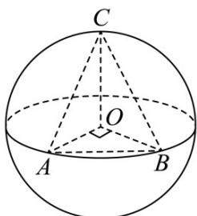

> [!faq]- 《专题12 球体的外接与内切小题综合》真题解析
>
> > [!success]- **【答案】** C
>
> > [!note]- **【分析】**
> > 本题未单列分析。
>
> > [!note]- **【解析】**
> > 【答案】C
> > 【详解】
> > 
> > 如图所示，当点 $^{C}$ 位于垂直于面AOB的直径端点时，三棱锥O-ABC的体积最大，设球O的半径为R，此
> > 时 $V_{O - ABC} = V_{C - AOB} = \frac{1}{3}\times \frac{1}{2} R^2\times R = \frac{1}{6} R^3 = 36$ ，故 $R = 6$ ，则球 $O$ 的表面积为 $S = 4\pi R^2 = 144\pi$ ，故选C.
> > 考点：外接球表面积和锥体的体积。
