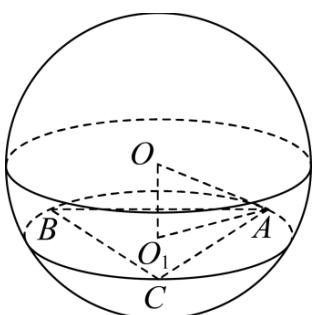

> [!faq]- 《专题12 球体的外接与内切小题综合》真题解析
>
> > [!success]- **【答案】** A
>
> > [!note]- **【分析】**
> > 【分析】由已知可得等边 $\triangle ABC$ 的外接圆半径，进而求出其边长，得出 $OO_{1}$ 的值，根据球的截面性质，求出球的半径，即可得出结论
>
> > [!note]- **【解析】**
> > 【详解】设圆 $O_{1}$ 半径为 r，球的半径为 R，依题意，
> > 得 $\pi r^{2} = 4\pi, \therefore r = 2, \because \triangle ABC$ 为等边三角形，
> > 由正弦定理可得 $AB = 2r\sin60^{\circ} = 2\sqrt{3}$ $\therefore OO_{1} = AB = 2\sqrt{3}$ ，根据球的截面性质 $OO_{1} \perp$ 平面 ABC， $\therefore OO_{1} \perp O_{1}A, R = OA = \sqrt{OO_{1}^{2} + O_{1}A^{2}} = \sqrt{OO_{1}^{2} + r^{2}} = 4$ $\therefore$ 球 O 的表面积 $S = 4\pi R^{2} = 64\pi$
> > 故选：A
> > 
> > 【点睛】
> > 本题考查球的表面积，应用球的截面性质是解题的关键，考查计算求解能力，属于基础题
