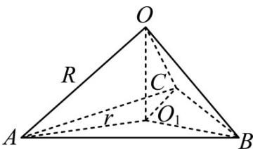

> [!faq]- 《专题12 球体的外接与内切小题综合》真题解析
>
> > [!success]- **【答案】** C
>
> > [!note]- **【分析】**
> > 【分析】根据球 O 的表面积和 $\triangle ABC$ 的面积可求得球 O 的半径 R 和 $\triangle ABC$ 外接圆半径 r，由球的性质可知所求距离 $d = \sqrt{R^{2} - r^{2}}$ .
>
> > [!note]- **【解析】**
> > 【详解】
> > 
> > 设球 O 的半径为 R，则 $4\pi R^{2} = 16\pi$ ，解得：R = 2。
> > 设 $\triangle ABC$ 外接圆半径为 r，边长为 a， $\because \triangle ABC$ 是面积为 $\frac{9\sqrt{3}}{4}$ 的等边三角形， $\therefore \frac{1}{2}a^{2} \times \frac{\sqrt{3}}{2} = \frac{9\sqrt{3}}{4}$ ，解得： $a = 3$ ， $\therefore r = \frac{2}{3} \times \sqrt{a^{2} - \frac{a^{2}}{4}} = \frac{2}{3} \times \sqrt{9 - \frac{9}{4}} = \sqrt{3}$ ，
> > ∴ 球心 O 到平面 ABC 的距离 $d = \sqrt{R^{2} - r^{2}} = \sqrt{4 - 3} = 1$ .
> > 故选：C.
> > 【点睛】本题考查球的相关问题的求解，涉及到球的表面积公式和三角形面积公式的应用；解题关键是明确球的性质，即球心和三角形外接圆圆心的连线必垂直于三角形所在平面·
