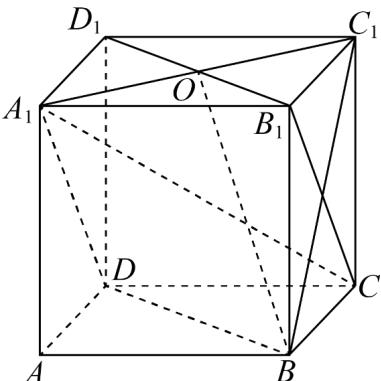
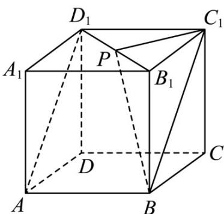
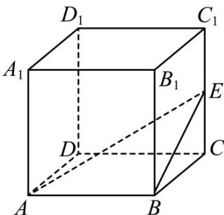
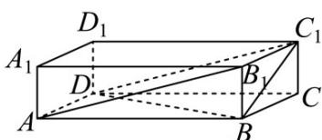
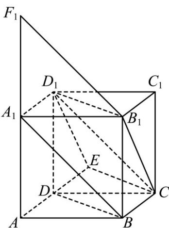
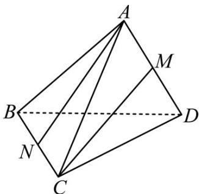
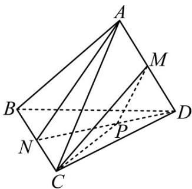

<!-- source-part:1 pages:1-24 -->

# 十年真题 2015-2024

# 专题 13 立体几何的空间角与空间距离 及其综合应用小题综合

## 十年考情·探规律

<table><tr><td>考点</td><td>十年考情(2015-2024)</td><td>命题趋势</td></tr><tr><td>考点1 异面直线所成角及其应用(10年6考)</td><td>2022·全国新I卷、2021·全国乙卷、2018·全国卷2017·全国卷、2016·全国卷、2015·浙江卷</td><td rowspan="4">要熟练掌握几何法和向量法求解空间角与空间距离,本节内容是新高考卷的常考内容,要熟练掌握方程思想求值,需强化巩固复习.</td></tr><tr><td>考点2 线面角及其应用(10年4考)</td><td>2024·全国新II卷、2023·全国乙卷、2022·浙江卷2022·全国甲卷、2022·全国新I卷、2018·浙江卷2018·全国卷、2018·全国卷、2018·全国卷</td></tr><tr><td>考点3 二面角及其应用(10年6考)</td><td>2023·北京卷、2023·全国乙卷、2023·全国新II卷2022·浙江卷、2019·浙江卷、2018·浙江卷2017·浙江卷、2015·浙江卷</td></tr><tr><td>考点4 点面距及其应用(10年1考)</td><td>2019·全国卷</td></tr></table>

## 分考点·精准练

考点01 异面直线所成角及其应用

1. (2022·全国新I卷·高考真题) (多选) 已知正方体 $ABCD - A_1B_1C_1D_1$ ，则 ( )

A. 直线 $BC_1$ 与 $DA_1$ 所成的角为 $90^\circ$ B. 直线 $BC_1$ 与 $CA_1$ 所成的角为 $90^\circ$

C．直线 $BC_{1}$ 与平面 $BB_{1}D_{1}D$ 所成的角为 $45^{\circ}D$ ．直线 $BC_{1}$ 与平面 ABCD 所成的角为 $45^{\circ}$

【答案】ABD

【分析】数形结合，依次对所给选项进行判断即可·

【详解】如图，连接 $B_{1}C$ 、 $BC_{1}$ ，因为 $DA_{1} / / B_{1}C$ ，所以直线 $BC_{1}$ 与 $B_{1}C$ 所成的角即为直线 $BC_{1}$ 与 $DA_{1}$ 所成的角，

因为四边形 $BB_{1}C_{1}C$ 为正方形，则 $B_{1}C \perp BC_{1}$ ，故直线 $BC_{1}$ 与 $DA_{1}$ 所成的角为 $90^{\circ}$ ，A 正确；

连接 $A_{1}C$ ，因为 $A_{1}B_{1}\perp$ 平面 $BB_{1}C_{1}C$ ， $BC_{1}\subset$ 平面 $BB_{1}C_{1}C$ ，则 $A_{1}B_{1}\perp BC_{1}$

因为 $B_{1}C \perp BC_{1}$ ， $A_{1}B_{1} \cap B_{1}C = B_{1}$ ，所以 $BC_{1} \perp$ 平面 $A_{1}B_{1}C$ ，

又 $A_{1}C \subset$ 平面 $A_{1}B_{1}C$ ，所以 $BC_{1} \perp CA_{1}$ ，故 B 正确；

连接 $A_{1}C_{1}$ ，设 $A_{1}C_{1} \cap B_{1}D_{1} = O$ ，连接 BO，

因为 $BB_{1} \perp$ 平面 $A_{1}B_{1}C_{1}D_{1}$ ， $C_{1}O \subset$ 平面 $A_{1}B_{1}C_{1}D_{1}$ ，则 $C_{1}O \perp B_{1}B$

因为 $C_{1}O \perp B_{1}D_{1}$ ， $B_{1}D_{1} \cap B_{1}B = B_{1}$ ，所以 $C_{1}O \perp$ 平面 $BB_{1}D_{1}D$ ，

所以 $\angle C_{1}BO$ 为直线 $BC_{1}$ 与平面 $BB_{1}D_{1}D$ 所成的角，

设正方体棱长为 $1$ ，则 $C_1O = \frac{\sqrt{2}}{2}$ ， $BC_{1} = \sqrt{2}$ ， $\sin \angle C_1BO = \frac{C_1O}{BC_1} = \frac{1}{2}$

所以，直线 $BC_{1}$ 与平面 $BB_{1}D_{1}D$ 所成的角为 $30^{\circ}$ ，故 C 错误；

因为 $C_{1}C \perp$ 平面 ABCD，所以 $\angle C_{1}BC$ 为直线 $BC_{1}$ 与平面 ABCD 所成的角，易得 $\angle C_{1}BC = 45^{\circ}$ ，故 D 正确。
故选：ABD

2. (2021·全国乙卷·高考真题) 在正方体 $ABCD - A_{1}B_{1}C_{1}D_{1}$ 中， $P$ 为 $B_{1}D_{1}$ 的中点，则直线 $PB$ 与 $AD_{1}$ 所成的角为（ ）A. $\frac{\pi}{2}$ B. $\frac{\pi}{3}$ C. $\frac{\pi}{4}$ D. $\frac{\pi}{6}$

【答案】D

【分析】平移直线 $AD_{1}$ 至 $BC_{1}$ ，将直线 PB 与 $AD_{1}$ 所成的角转化为 PB 与 $BC_{1}$ 所成的角，解三角形即可.

【详解】

如图，连接 $BC_{1},PC_{1},PB$ ，因为 $AD_{1}\parallel BC_{1}$ ，

所以 $\angle PBC_{1}$ 或其补角为直线 $PB$ 与 $AD_{1}$ 所成的角，

因为 $BB_{1} \perp$ 平面 $A_{1}B_{1}C_{1}D_{1}$ ，所以 $BB_{1} \perp PC_{1}$ ，又 $PC_{1} \perp B_{1}D_{1}$ ， $BB_{1} \cap B_{1}D_{1} = B_{1}$

所以 $PC_{1} \perp$ 平面 $PBB_{1}$ ，所以 $PC_{1} \perp PB$

设正方体棱长为 $2$ ，则 $BC_{1} = 2\sqrt{2}, PC_{1} = \frac{1}{2} D_{1}B_{1} = \sqrt{2}$

$\sin\angle PBC_{1}=\frac{PC_{1}}{BC_{1}}=\frac{1}{2}$ ，所以 $\angle PBC_{1}=\frac{\pi}{6}$ .

故选：D

3. (2018·全国·高考真题) 在正方体 $ABCD - A_{1}B_{1}C_{1}D_{1}$ 中， $E$ 为棱 $CC_{1}$ 的中点，则异面直线 $AE$ 与 $CD$ 所成角的正切值为
A. $\frac{\sqrt{2}}{2}$ B. $\frac{\sqrt{3}}{2}$ C. $\frac{\sqrt{5}}{2}$ D. $\frac{\sqrt{7}}{2}$

【答案】C

【分析】利用正方体 $ABCD - A_{1}B_{1}C_{1}D_{1}$ 中， $CD \parallel AB$ ，将问题转化为求共面直线 AB 与 AE 所成角的正切值，在 $\Delta ABE$ 中进行计算即可.

【详解】在正方体 $ABCD - A_{1}B_{1}C_{1}D_{1}$ 中， $CD \parallel AB$ ，所以异面直线 AE 与 CD 所成角为 $\angle EAB$ ，设正方体边长为 2a，则由 E 为棱 $CC_{1}$ 的中点，可得 CE = a，所以 $BE = \sqrt{5}a$ ，则 $\tan \angle EAB = \frac{BE}{AB} = \frac{\sqrt{5}a}{2a} = \frac{\sqrt{5}}{2}$ ·故选 C.

【点睛】求异面直线所成角主要有以下两种方法：

(1) 几何法：①平移两直线中的一条或两条，到一个平面中；②利用边角关系，找到（或构造）所求角所在的三角形；③求出三边或三边比例关系，用余弦定理求角；

(2) 向量法：①求两直线的方向向量；②求两向量夹角的余弦；③因为直线夹角为锐角，所以②对应的余弦取绝对值即为直线所成角的余弦值.

4.（2017·全国·高考真题）已知直三棱柱 $\mathrm{ABC - A_1B_1C_1}$ 中， $\angle ABC = 120^{\circ}$ ， $\mathrm{AB} = 2$ ， $\mathrm{BC} = \mathrm{CC}_1 = 1$ ，则异面直线 $\mathrm{AB}_1$ 与 $\mathrm{BC}_1$ 所成角的余弦值为
A. $\frac{\sqrt{3}}{2}$ B. $\frac{\sqrt{15}}{5}$ C. $\frac{\sqrt{10}}{5}$ D. $\frac{\sqrt{3}}{3}$

【答案】C

【详解】如图所示，补成直四棱柱 $ABCD - A_{1}B_{1}C_{1}D_{1}$

则所求角为 $\angle BC_{1}D,\because BC_{1} = \sqrt{2},BD = \sqrt{2^{2} + 1 - 2\times 2\times 1\times\cos60^{\circ}} = \sqrt{3},C_{1}D = AB_{1} = \sqrt{5}$

易得 $C_1D^2 = BD^2 +BC_1^2$ ，因此 $\cos \angle BC_1D = \frac{BC_1}{C_1D} = \frac{\sqrt{2}}{\sqrt{5}} = \frac{\sqrt{10}}{5}$ ，故选C

平移法是求异面直线所成角的常用方法，其基本思路是通过平移直线，把异面问题化归为共面问题

来解决，具体步骤如下：

①平移：平移异面直线中的一条或两条，作出异面直线所成的角；

②认定：证明作出的角就是所求异面直线所成的角；

③计算：求该角的值，常利用解三角形；

④取舍：由异面直线所成的角的取值范围是 $(0, \frac{\pi}{2}]$ ，当所作的角为钝角时，应取它的补角作为两条异面直线所成的角．求异面直线所成的角要特别注意异面直线之间所成角的范围．

5. (2016·全国·高考真题) 平面 $\alpha$ 过正方体 $ABCD-A_{1}B_{1}C_{1}D_{1}$ 的顶点 $A$ , $\alpha//$ 平面 $CB_{1}D_{1}, \alpha \cap$ 平面 $ABCD = m$ , $\alpha \cap$ 平面 $ABB_{1}A_{1} = n$ , 则 $m, n$ 所成角的正弦值为
A. $\frac{\sqrt{3}}{2}$ B. $\frac{\sqrt{2}}{2}$ C. $\frac{\sqrt{3}}{3}$ D. $\frac{1}{3}$

【答案】A

【详解】试题分析：如图，设平面 $CB_{1}D_{1} \cap$ 平面 $ABCD = m'$ ，平面 $CB_{1}D_{1} \cap$ 平面 $ABB_{1}A_{1} = n'$ ，因为 $\alpha //$ 平面 $CB_{1}D_{1}$ ，所以 $m // m', n // n'$ ，则 $m, n$ 所成的角等于 $m', n'$ 所成的角·延长 $AD$ ，过 $D_{1}$ 作 $D_{1}E \parallel B_{1}C$ ，连接 $CE, B_{1}D_{1}$ ，则 $CE$ 为 $m'$ ，同理 $B_{1}F_{1}$ 为 $n'$ ，而 $BD \parallel CE, B_{1}F_{1} \parallel A_{1}B$ ，则 $m', n'$ 所成的角即为 $A_{1}B, BD$ 所成的角，即为 $60^{\circ}$ ，故 $m, n$ 所成角的正弦值为 $\frac{\sqrt{3}}{2}$ ，选 A.

【点睛】求解本题的关键是作出异面直线所成的角·求异面直线所成角的步骤是：平移定角、连线成形、解形求角、得钝求补·

6. (2015·浙江·高考真题) 如图, 三棱锥 $A - BCD$ 中, $AB = AC = BD = CD = 3, AD = BC = 2$ , 点 $M, N$ 分

别是 $AD, BC$ 的中点，则异面直线 $AN, CM$ 所成的角的余弦值是 \_\_\_\_。

【答案】 $\frac{7}{8}$

【详解】如下图，连结 $DN$ ，取 $DN$ 中点 $P$ ，连结 $PM$ ， $PC$ ，则可知 $\angle PMC$ 即为异面直线 $AN$ ， $CM$ 所成角（或其补角）易得 $PM = \frac{1}{2} AN = \sqrt{2}$ ， $PC = \sqrt{PN^2 + CN^2} = \sqrt{2 + 1} = \sqrt{3}$ ， $CM = \sqrt{AC^2 - AM^2} = 2\sqrt{2}$ ， $\cos \angle PMC = \frac{8 + 2 - 3}{2 \times 2\sqrt{2} \times \sqrt{2}} = \frac{7}{8}$ ，即异面直线 $AN$ ， $CM$ 所成角的余弦值为 $\frac{7}{8}$ 。

考点：异面直线的夹角·

![[高中/真题/按题型分类/专题13 立体几何的空间角与空间距离及其综合应用小题综合/考点02_线面角及其应用/考点02_线面角及其应用.md]]
![[高中/真题/按题型分类/专题13 立体几何的空间角与空间距离及其综合应用小题综合/考点03_二面角及其应用/考点03_二面角及其应用.md]]
![[高中/真题/按题型分类/专题13 立体几何的空间角与空间距离及其综合应用小题综合/考点04_点面距及其应用/考点04_点面距及其应用.md]]
