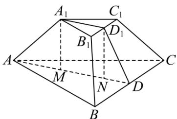
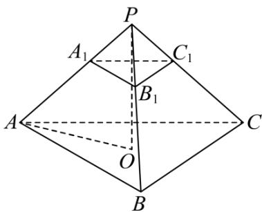

> [!faq]- 《专题13 立体几何的空间角与空间距离及其综合应用小题综合》真题解析
>
> > [!success]- **【答案】** B
>
> > [!note]- **【分析】**
> > 【分析】解法一：根据台体的体积公式可得三棱台的高 $h = \frac{4\sqrt{3}}{3}$ ，做辅助线，结合正三棱台的结构特征求得 $AM = \frac{4\sqrt{3}}{3}$ ，进而根据线面夹角的定义分析求解；解法二：将正三棱台 $ABC - A_{1}B_{1}C_{1}$ 补成正三棱锥 $P - ABC$ ， $A_{1}A$ 与平面 $ABC$ 所成角即为 $PA$ 与平面 $ABC$ 所成角，根据比例关系可得 $V_{P - ABC} = 18$ ，进而可求正三棱锥 $P - ABC$ 的高，即可得结果·
>
> > [!note]- **【解析】**
> > 【详解】解法一：分别取 $BC, B_{1}C_{1}$ 的中点 $D, D_{1}$ ，则 $AD = 3\sqrt{3}, A_{1}D_{1} = \sqrt{3}$
> > 可知 $S_{\triangle ABC} = \frac{1}{2}\times 6\times 6\times \frac{\sqrt{3}}{2} = 9\sqrt{3},S_{\triangle A_1B_1C_1} = \frac{1}{2}\times 2\times \sqrt{3} = \sqrt{3}$
> > 设正三棱台 $ABC - A_{1}B_{1}C_{1}$ 的为 h ，
> > 则 $V_{ABC-A_{1}B_{1}C_{1}}=\frac{1}{3}\left(9\sqrt{3}+\sqrt{3}+\sqrt{9\sqrt{3}\times\sqrt{3}}\right)h=\frac{52}{3}$ ，解得 $h=\frac{4\sqrt{3}}{3}$ ，
> > 如图，分别过 $A_{1}, D_{1}$ 作底面垂线，垂足为 $M, N$ ，设 $AM = x$ ，
> > 
> > 则 $AA_{1} = \sqrt{AM^{2} + A_{1}M^{2}} = \sqrt{x^{2} + \frac{16}{3}}$ ， $DN = AD - AM - MN = 2\sqrt{3} - x$
> > 可得 $DD_{1} = \sqrt{DN^{2} + D_{1}N^{2}} = \sqrt{\left(2\sqrt{3} - x\right)^{2} + \frac{16}{3}}$
> > 结合等腰梯形 $BCC_{1}B_{1}$ 可得 $BB_{1}^{2} = \left(\frac{6 - 2}{2}\right)^{2} + DD_{1}^{2}$
> > 即 $x^{2} + \frac{16}{3} = (2\sqrt{3} - x)^{2} + \frac{16}{3} + 4$ ，解得 $x = \frac{4\sqrt{3}}{3}$
> > 所以 $A_{1}A$ 与平面 $ABC$ 所成角的正切值为 $\tan \Theta A_{1}AD = \frac{A_{1}M}{AM} = 1$
> > 解法二：将正三棱台 $ABC - A_{1}B_{1}C_{1}$ 补成正三棱锥 P - ABC ，
> > 
> > 则 $A_{1}A$ 与平面 ABC 所成角即为 PA 与平面 ABC 所成角，
> > 因为 $\frac{PA_1}{PA} = \frac{A_1B_1}{AB} = \frac{1}{3}$ ，则 $\frac{V_{P - A_1B_1C_1}}{V_{P - ABC}} = \frac{1}{27}$
> > 可知 $V_{ABC-A_{1}B_{1}C_{1}}=\frac{26}{27}V_{P-ABC}=\frac{52}{3}$ ，则 $V_{P-ABC}=18$ ，
> > 设正三棱锥 $P - ABC$ 的高为 $d$ ，则 $V_{P - ABC} = \frac{1}{3} d \times \frac{1}{2} \times 6 \times 6 \times \frac{\sqrt{3}}{2} = 18$ ，解得 $d = 2\sqrt{3}$ ，取底面 $ABC$ 的中心为 $O$ ，则 $PO \perp$ 底面 $ABC$ ，且 $AO = 2\sqrt{3}$ ，所以 $PA$ 与平面 $ABC$ 所成角的正切值 $\tan \angle PAO = \frac{PO}{AO} = 1$ .
> >
> > 故选 **B**.
