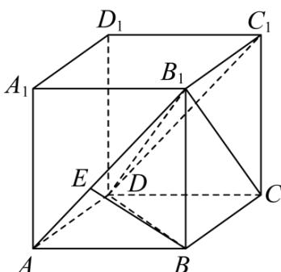

> [!faq]- 《专题13 立体几何的空间角与空间距离及其综合应用小题综合》真题解析
>
> > [!success]- **【答案】** D
>
> > [!note]- **【分析】**
> > 根据线面角的定义以及长方体的结构特征即可求出.
>
> > [!note]- **【解析】**
> > 如图所示：
> > 
> > 不妨设 AB = a, AD = b, $AA_{1} = c$ ，依题以及长方体的结构特征可知， $B_{1}D$ 与平面 ABCD 所成角为 $\angle B_{1}DB$ ， $B_{1}D$ 与平面 $AA_{1}B_{1}B$ 所成角为 $\angle DB_{1}A$ ，所以 $\sin30^{\circ} = \frac{c}{B_{1}D} = \frac{b}{B_{1}D}$ ，即 b = c， $B_{1}D = 2c = \sqrt{a^{2} + b^{2} + c^{2}}$ ，解得 $a = \sqrt{2}c$ 。
> > 对于 $\mathsf{A}$ ， $AB = a$ ， $AD = b$ ， $AB = \sqrt{2} AD$ ， $\mathsf{A}$ 错误；
> > 对于 $^{B}$ ，过 B 作 $BE \perp AB_{1}$ 于 E，易知 $BE \perp$ 平面 $AB_{1}C_{1}D$ ，所以 AB 与平面 $AB_{1}C_{1}D$ 所成角为 $\angle BAE$ ，因为 $\tan\angle BAE=\frac{c}{a}=\frac{\sqrt{2}}{2}$ ，所以 $\angle BAE\neq30^{\circ}$ ， $^{B}$ 错误；
> > 对于 C， $AC = \sqrt{a^{2} + b^{2}} = \sqrt{3}c$ ， $CB_{1} = \sqrt{b^{2} + c^{2}} = \sqrt{2}c$ ， $AC \neq CB_{1}$ ，C 错误；
> > 对于 D， $B_{1}D$ 与平面 $BB_{1}C_{1}C$ 所成角为 $\angle DB_{1}C$ ， $\sin\angle DB_{1}C=\frac{CD}{B_{1}D}=\frac{a}{2c}=\frac{\sqrt{2}}{2}$ ，而 $0<\angle DB_{1}C<90^{\circ}$ ，所以 $\angle DB_{1}C=45^{\circ}$ 。D 正确。
> >
> > 故选 **D**.
