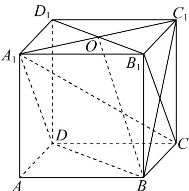

> [!faq]- 《专题13 立体几何的空间角与空间距离及其综合应用小题综合》真题解析
>
> > [!success]- **【答案】** ABD
>
> > [!note]- **【分析】**
> > 数形结合，依次对所给选项进行判断即可·
>
> > [!note]- **【解析】**
> > 如图，连接 $B_{1}C$ 、 $BC_{1}$ ，因为 $DA_{1} / / B_{1}C$ ，所以直线 $BC_{1}$ 与 $B_{1}C$ 所成的角即为直线 $BC_{1}$ 与 $DA_{1}$ 所成的角，
> > 因为四边形 $BB_{1}C_{1}C$ 为正方形，则 $B_{1}C \perp BC_{1}$ ，故直线 $BC_{1}$ 与 $DA_{1}$ 所成的角为 $90^{\circ}$ ， $\mathsf{A}$ 正确；
> > 
> > 连接 $A_{1}C$ ，因为 $A_{1}B_{1}\perp$ 平面 $BB_{1}C_{1}C$ ， $BC_{1}\subset$ 平面 $BB_{1}C_{1}C$ ，则 $A_{1}B_{1}\perp BC_{1}$
> > 因为 $B_{1}C \perp BC_{1}$ ， $A_{1}B_{1} \cap B_{1}C = B_{1}$ ，所以 $BC_{1} \perp$ 平面 $A_{1}B_{1}C$ ，
> > 又 $A_{1}C \subset$ 平面 $A_{1}B_{1}C$ ，所以 $BC_{1} \perp CA_{1}$ ，故 $\mathsf{B}$ 正确；
> > 连接 $A_{1}C_{1}$ ，设 $A_{1}C_{1} \cap B_{1}D_{1} = O$ ，连接 BO，
> > 因为 $BB_{1} \perp$ 平面 $A_{1}B_{1}C_{1}D_{1}$ ， $C_{1}O \subset$ 平面 $A_{1}B_{1}C_{1}D_{1}$ ，则 $C_{1}O \perp B_{1}B$
> > 因为 $C_{1}O \perp B_{1}D_{1}$ ， $B_{1}D_{1} \cap B_{1}B = B_{1}$ ，所以 $C_{1}O \perp$ 平面 $BB_{1}D_{1}D$ ，
> > 所以 $\angle C_{1}BO$ 为直线 $BC_{1}$ 与平面 $BB_{1}D_{1}D$ 所成的角，
> > 设正方体棱长为 $1$ ，则 $C_1O = \frac{\sqrt{2}}{2}$ ， $BC_{1} = \sqrt{2}$ ， $\sin \angle C_1BO = \frac{C_1O}{BC_1} = \frac{1}{2}$
> > 所以，直线 $BC_{1}$ 与平面 $BB_{1}D_{1}D$ 所成的角为 $30^{\circ}$ ，故 C 错误；
> > 因为 $C_{1}C \perp$ 平面 ABCD，所以 $\angle C_{1}BC$ 为直线 $BC_{1}$ 与平面 ABCD 所成的角，易得 $\angle C_{1}BC = 45^{\circ}$ ，故 D 正确。
> >
> > 故选 **ABD**
