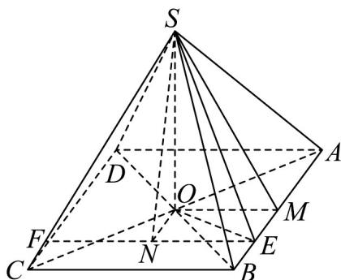

> [!faq]- 《专题13 立体几何的空间角与空间距离及其综合应用小题综合》真题解析
>
> > [!success]- **【答案】** D
>
> > [!note]- **【分析】**
> > 分别作出线线角、线面角以及二面角，再构造直角三角形，根据边的大小关系确定角的大小关系。
>
> > [!note]- **【解析】**
> > 设 O 为正方形 ABCD 的中心，M 为 AB 中点，过 E 作 BC 的平行线 EF，交 CD 于 F，过 O 作 ON 垂直 EF 于 N，连接 SO、SN、OM，则 SO 垂直于底面 ABCD，OM 垂直于 AB，
> > 因此 $\angle SEN = \theta_{1}, \angle SEO = \theta_{2}, \angle SMO = \theta_{3}$ 从而 $\tan\theta_{1}=\frac{SN}{EN}=\frac{SN}{OM},\tan\theta_{2}=\frac{SO}{EO},\tan\theta_{3}=\frac{SO}{OM}$ 因为 SN  SO, EO  OM ，所以 $\tan\theta_{1}\quad\tan\theta_{3}\quad\tan\theta_{2}$ ，即 $\theta_{1}\quad\theta_{3}\quad\theta_{2}$ ，选 D.
> > 
> > 【点睛】线线角找平行，线面角找垂直，面面角找垂面·
