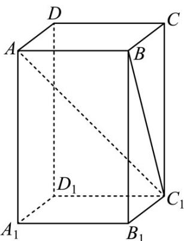

> [!faq]- 《专题13 立体几何的空间角与空间距离及其综合应用小题综合》真题解析
>
> > [!success]- **【答案】** C
>
> > [!note]- **【分析】**
> > 【分析】首先画出长方体 $ABCD - A_{1}B_{1}C_{1}D_{1}$ ，利用题中条件，得到 $\angle AC_{1}B = 30^{\circ}$ ，根据 $AB = 2$ ，求得 $BC_{1} = 2\sqrt{3}$ ，可以确定 $CC_{1} = 2\sqrt{2}$ ，之后利用长方体的体积公式求出长方体的体积·
>
> > [!note]- **【解析】**
> > 【详解】在长方体 $ABCD - A_{1}B_{1}C_{1}D_{1}$ 中，连接 $BC_{1}$ 根据线面角的定义可知 $\angle AC_{1}B = 30^{\circ}$ ，
> > 因为 AB = 2，所以 $BC_{1} = 2\sqrt{3}$ ，从而求得 $CC_{1} = 2\sqrt{2}$ ，
> > 所以该长方体的体积为 $V = 2 \times 2 \times 2\sqrt{2} = 8\sqrt{2}$ ，故选 C.
> > 
> > 【点睛】该题考查的是长方体的体积的求解问题，在解题的过程中，需要明确长方体的体积公式为长宽高的乘积，而题中的条件只有两个值，所以利用题中的条件求解另一条边的长就显得尤为重要，此时就需要明确线面角的定义，从而得到量之间的关系，从而求得结果·
