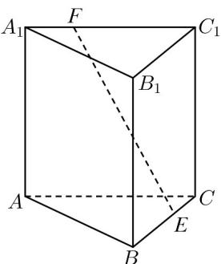

<!-- question-source:start -->
4. (2022·浙江·高考真题) 如图, 已知正三棱柱 $ABC - A_1B_1C_1, AC = AA_1$ , $E$ , $F$ 分别是棱 $BC, A_1C_1$ 上的点. 记 $EF$ 与 $AA_1$ 所成的角为 $\alpha$ , $EF$ 与平面 $ABC$ 所成的角为 $\beta$ , 二面角 $F - BC - A$ 的平面角为 $\gamma$ , 则 ( )

A. $\alpha \leq \beta \leq \gamma$ B. $\beta \leq \alpha \leq \gamma$ C. $\beta \leq \gamma \leq \alpha$ D. $\alpha \leq \gamma \leq \beta$
<!-- question-source:end -->

![[高中/真题/按题型分类/专题13 立体几何的空间角与空间距离及其综合应用小题综合/考点03_二面角及其应用/真题/answers/Q00034254A1.md]]
