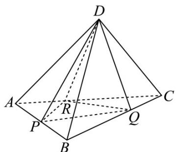

<!-- question-source:start -->
7．（2017·浙江·高考真题）如图，已知正四面体 D-ABC（所有棱长均相等的三棱锥），P, Q, R 分别为 AB, BC, CA 上的点，AP=PB, $\frac{BQ}{QC}=\frac{CR}{RA}=2$ ，分别记二面角 D-PR-Q, D-PQ-R, D-QR-P 的平面角为 $\alpha,\beta,\gamma$ ，则

A. $\gamma <  \alpha <  \beta$ B. $a <   \gamma <  \beta$ C. $a <   \beta <  \gamma$ D. $\beta <  \gamma <  a$
<!-- question-source:end -->

![[高中/真题/按题型分类/专题13 立体几何的空间角与空间距离及其综合应用小题综合/考点03_二面角及其应用/真题/answers/Q00034257A1.md]]
