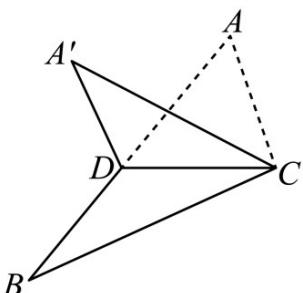

<!-- question-source:start -->
8．（2015·浙江·高考真题）如图，已知 $\Delta ABC$ ，D 是 AB 的中点，沿直线 CD 将 $\Delta ACD$ 折成 $\Delta A\Phi CD$ ，所成二面角 $A'-CD-B$ 的平面角为 $\alpha$ ，则

A. $\angle A^{\prime}DB\leq \alpha$ B. $\angle A^{\prime}DB\quad \alpha$ C. $\angle A^{\prime}CB\leq \alpha$ D. $\angle A^{\prime}CB\quad \alpha$
<!-- question-source:end -->

![[高中/真题/按题型分类/专题13 立体几何的空间角与空间距离及其综合应用小题综合/考点03_二面角及其应用/真题/answers/Q00034258A1.md]]
