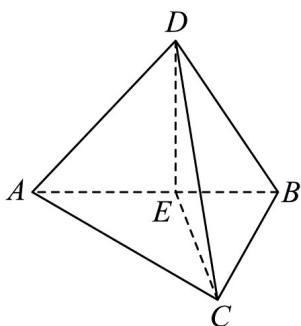

> [!faq]- 《专题13 立体几何的空间角与空间距离及其综合应用小题综合》真题解析
>
> > [!success]- **【答案】** C
>
> > [!note]- **【分析】**
> > 【分析】根据给定条件，推导确定线面角，再利用余弦定理、正弦定理求解作答·
>
> > [!note]- **【解析】**
> > 【详解】取 $AB$ 的中点 $E$ ，连接 $CE, DE$ ，因为 $\triangle ABC$ 是等腰直角三角形，且 $AB$ 为斜边，则有 $CE \perp AB$ 又 $\triangle ABD$ 是等边三角形，则 $DE \perp AB$ ，从而 $\angle CED$ 为二面角 $C - AB - D$ 的平面角，即 $\angle CED = 150^{\circ}$ ，
> > 
> > 显然 $CE \cap DE = E, CE, DE \subset$ 平面 $CDE$ ，于是 $AB \perp$ 平面 $CDE$ ，又 $AB \subset$ 平面 $ABC$
> > 因此平面 $CDE \perp$ 平面 ABC ，显然平面 $CDE \cap$ 平面 ABC = CE ，
> > 直线 $CD \subset$ 平面 $CDE$ ，则直线 $CD$ 在平面 $ABC$ 内的射影为直线 $CE$
> > 从而 $\angle DCE$ 为直线 $CD$ 与平面 $ABC$ 所成的角，令 $AB = 2$ ，则 $CE = 1, DE = \sqrt{3}$ ，在 $\triangle CDE$ 中，由余弦定理得：
> > $$
> > C D = \sqrt {C E ^ {2} + D E ^ {2} - 2 C E \cdot D E \cos \angle C E D} = \sqrt {1 + 3 - 2 \times 1 \times \sqrt {3} \times (- \frac {\sqrt {3}}{2})} = \sqrt {7}
> > $$
> > 由正弦定理得 $\frac{DE}{\sin\angle DCE} = \frac{CD}{\sin\angle CED}$ ，即 $\sin \angle DCE = \frac{\sqrt{3}\sin 150^{\circ}}{\sqrt{7}} = \frac{\sqrt{3}}{2\sqrt{7}}$
> > 显然 $\angle DCE$ 是锐角， $\cos \angle DCE = \sqrt{1 - \sin^2 \angle DCE} = \sqrt{1 - (\frac{\sqrt{3}}{2\sqrt{7}})^2} = \frac{5}{2\sqrt{7}}$
> > 所以直线 CD 与平面 ABC 所成的角的正切为 $\frac{\sqrt{3}}{5}$ .
> >
> > 故选 **C**
