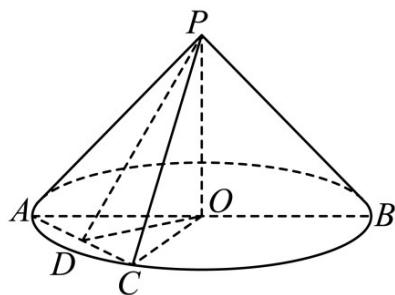

> [!faq]- 《专题13 立体几何的空间角与空间距离及其综合应用小题综合》真题解析
>
> > [!success]- **【答案】** AC
>
> > [!note]- **【分析】**
> > 根据圆锥的体积、侧面积判断 A、B 选项的正确性，利用二面角的知识判断 C、D 选项的正确性。
>
> > [!note]- **【解析】**
> > 依题意， $\angle APB=120^{\circ}$ ，PA=2，所以 $OP=1, OA=OB=\sqrt{3}$ ，
> > A 选项，圆锥的体积为 $\frac{1}{3} \times \pi \times (\sqrt{3})^2 \times 1 = \pi$ ，A 选项正确；
> > B 选项，圆锥的侧面积为 $\pi \times \sqrt{3} \times 2 = 2\sqrt{3}\pi$ ，B 选项错误；
> > $^{C}$ 选项，设D是AC的中点，连接OD,PD
> > 则 $AC \perp OD, AC \perp PD$ ，所以 $\angle PDO$ 是二面角 P - AC - O 的平面角，
> > 则 $\angle PDO = 45^{\circ}$ ，所以 $OP = OD = 1$
> > 故 $AD = CD = \sqrt{3 - 1} = \sqrt{2}$ ，则 $AC = 2\sqrt{2}$ ，C选项正确；
> > D 选项， $PD = \sqrt{1^{2} + 1^{2}} = \sqrt{2}$ ，所以 $S_{\triangle PAC} = \frac{1}{2} \times 2\sqrt{2} \times \sqrt{2} = 2$ ，D 选项错误.
> > 故选：AC.
> > 
