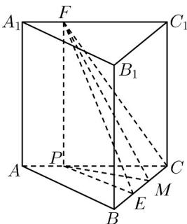

> [!faq]- 《专题13 立体几何的空间角与空间距离及其综合应用小题综合》真题解析
>
> > [!success]- **【答案】** A
>
> > [!note]- **【分析】**
> > 【分析】先用几何法表示出 $\alpha, \beta, \gamma$ ，再根据边长关系即可比较大小。
>
> > [!note]- **【解析】**
> > 【详解】如图所示，过点 F 作 $FP \perp AC$ 于 P，过 P 作 $PM \perp BC$ 于 M，连接 PE，
> > 
> > 则 $\alpha = \angle EFP$ ， $\beta = \angle FEP$ ， $\gamma = \angle FMP$
> > $$
> > \tan \alpha = \frac {P E}{F P} = \frac {P E}{A B} \leq 1, \tan \beta = \frac {F P}{P E} = \frac {A B}{P E} 1, \tan \gamma = \frac {F P}{P M} \quad \frac {F P}{P E} = \tan \beta
> > $$
> > 所以 $\alpha \leq \beta \leq \gamma$
> >
> > 故选 **A**.
