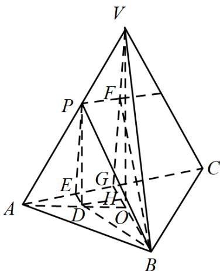

> [!faq]- 《专题13 立体几何的空间角与空间距离及其综合应用小题综合》真题解析
>
> > [!success]- **【答案】** B
>
> > [!note]- **【分析】**
> > 本题未单列分析。
>
> > [!note]- **【解析】**
> > 【答案】B
> > 【解析】本题以三棱锥为载体，综合考查异面直线所成的角、直线与平面所成的角、二面角的概念，以及各种角的计算·解答的基本方法是通过明确各种角，应用三角函数知识求解，而后比较大小·而充分利用图形特征，则可事倍功半·
> > 【详解】方法 $^{1}$ ：如图G为AC中点，V在底面ABC的投影为O，则P在底面投影D在线段AO上，过D作DE垂直AE，易得PE//VG，过P作PF//AC交VG于F，过D作DH//AC，交BG于H，则 $\alpha=\angle BPF,\quad\beta=\angle PBD,\gamma=\angle PED$ ，则 $\cos\alpha=\frac{PF}{PB}=\frac{EG}{PB}=\frac{DH}{PB}<\frac{BD}{PB}=\cos\beta$ ，即 $\alpha>\beta$ $\tan\gamma=\frac{PD}{ED}>\frac{PD}{BD}=\tan\beta$ ，即 $y>\beta$ ，综上所述，答案为B.
> > 
> > 方法 $^{2}$ ：由最小角定理 $\beta < \alpha$ ，记 V - AB - C 的平面角为 $\gamma'$ （显然 $\gamma' = \gamma$ ）
> > 由最大角定理 $\beta < \gamma' = \gamma$ ，故选 B.
> > 方法 $^{3}$ ：（特殊位置）取V-ABC为正四面体，P为VA中点，易得
> > $\cos \alpha = \frac{\sqrt{3}}{6} \Rightarrow \sin \alpha = \frac{\sqrt{33}}{6}, \sin \beta = \frac{\sqrt{2}}{3}, \sin \gamma = \frac{2\sqrt{2}}{3}$ ，故选 B.
> > 【点睛】常规解法下易出现的错误有，不能正确作图得出各种角·未能想到利用“特殊位置法”，寻求简便解法·
