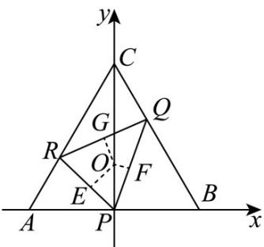

> [!faq]- 《专题13 立体几何的空间角与空间距离及其综合应用小题综合》真题解析
>
> > [!success]- **【答案】** B
>
> > [!note]- **【分析】**
> > 本题未单列分析。
>
> > [!note]- **【解析】**
> > 【答案】B
> > 【详解】设 O 为三角形 ABC 中心，则正四面体 D-ABC 的顶点在底面 ABC 的投影为 O，过 O 分别作 PR、PQ、RQ 的垂线，垂足分别为 E、F、G，连结 DE、DF、DG，则有 $\alpha=\angle DEO,\beta=\angle DFO,\gamma=\angle DGO,$ 所以 $\tan\alpha=\frac{OD}{OE},\tan\beta=\frac{OD}{OF},\tan\gamma=\frac{OD}{OG}$
> > 只需比较 $OE$ 、 $OF$ 、 $OG$ 的大小：
> > 在底面三角形 ABC 中，建立如图示的坐标系，
> > 
> > 不妨设 $AB = 2$ ，则 $A(-1,0),B(1,0),C(0,\sqrt{3}),P(0,0),Q\left(\frac{1}{3},\frac{2\sqrt{3}}{3}\right),R\left(-\frac{2}{3},\frac{\sqrt{3}}{3}\right),$
> > 所以直线 RP 的方程为 $y = -\frac{\sqrt{3}}{2}x$ ，直线 PQ 的方程为 $y = 2\sqrt{3}x$ ，直线 RQ 的方程为 $y = \frac{\sqrt{3}}{3}x + \frac{5\sqrt{3}}{9}$ ，由点到直线的距离公式，可求出： $OE = \frac{2\sqrt{21}}{21}, OF = \frac{\sqrt{39}}{39}, OG = \frac{1}{3}$ ，所以 $OE > OG > OF$ ，所以 $\tan \alpha < \tan \gamma < \tan \beta$ ，有 $\alpha, \beta, \gamma$ 均为锐角，所以 $\alpha < \gamma < \beta$ .
> > 故选：B
> > 【点睛】立体几何是高中数学中的重要内容，也是高考重点考查的考点与热点．这类问题的设置一般有线面位置关系的证明与角度距离的计算等两类问题．解答第一类问题时一般要借助线面平行与垂直的判定定理进行；解答第二类问题时先建立空间直角坐标系，运用空间向量的坐标形式及数量积公式进行求解．
