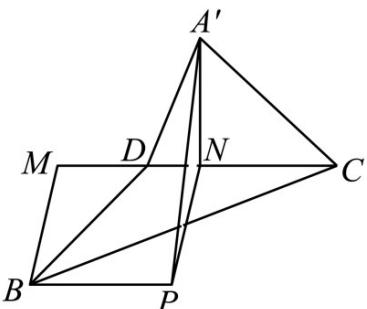

> [!faq]- 《专题13 立体几何的空间角与空间距离及其综合应用小题综合》真题解析
>
> > [!success]- **【答案】** B
>
> > [!note]- **【分析】**
> > 本题未单列分析。
>
> > [!note]- **【解析】**
> > 【答案】B
> > 【详解】设 $\angle ADC = \theta$ ，设 AB = 2，则由题意 AD = BD = 1，在空间图形中，设 $A'B = t$ ，在 $\Delta A'DB$ 中， $\cos \angle A'DB = \frac{A'D^{2} + DB^{2} - AB^{2}}{2A'D \times DB} = \frac{1^{2} + 1^{2} - t^{2}}{2 \times 1 \times 1} = \frac{2 - t^{2}}{2}$ ，
> > 在空间图形中，过 $A^{\prime}$ 作 $AN \perp DC$ ，过 $B$ 作 $BM \perp DC$ ，垂足分别为 $N$ ， $M$ ，
> > 过 $N$ 作 $NP \parallel MB$ ，连结 $A^{\prime}P$ ， $\therefore NP \perp DC$ ，
> > 则 $\angle A^{\prime}NP$ 就是二面角 $A^{\prime}-CD-B$ 的平面角， $\therefore \angle A^{\prime}NP = \alpha$ ，
> > 在 $Rt\triangle A^{\prime}ND$ 中， $DN = A^{\prime}D\cos\angle A^{\prime}DC = \cos\theta$ ， $A^{\prime}N = A^{\prime}D\sin\angle A^{\prime}DC = \sin\theta$ ，
> > 同理， $BM = PN = \sin\theta$ ， $DM = \cos\theta$ ，故 $BP = MN = 2\cos\theta$ ，
> > 显然 $BP \perp$ 面 $A^{\prime}NP$ ，故 $BP \perp A^{\prime}P$ ，
> > 在 $Rt\triangle A^{\prime}BP$ 中， $A^{\prime}P^{2} = A^{\prime}B^{2} - BP^{2} = t^{2} - (2\cos\theta)^{2} = t^{2} - 4\cos^{2}\theta$ ，
> > 在 $\triangle A^{\prime}NP$ 中， $\cos\alpha = \cos\angle A^{\prime}NP = \frac{A^{\prime}N^{2} + NP^{2} - A^{\prime}P^{2}}{2A^{\prime}N \times NP} = \frac{\sin^{2}\theta + \sin^{2}\theta - (t^{2} - 4\cos^{2}\theta)}{2\sin\theta \times \sin\theta}$ $= \frac{2 + 2\cos^{2}\theta - t^{2}}{2\sin^{2}\theta} = \frac{2 - t^{2}}{2\sin^{2}\theta} + \frac{\cos^{2}\theta}{\sin^{2}\theta} = \frac{1}{\sin^{2}\theta}\cos\angle A^{\prime}DB + \frac{\cos^{2}\theta}{\sin^{2}\theta}$ $\because \frac{1}{\sin^{2}\theta} > 0, \frac{\cos^{2}\theta}{\sin^{2}\theta} = 0, \therefore \cos\alpha = \cos\angle A^{\prime}DB (\text{当 } \theta = \frac{\pi}{2}\text{时取等号})$ ， $\because \alpha, \angle A^{\prime}DB \in [0,\pi]$ ，而 $y = \cos x$ 在 $[0,\pi]$ 上为递减函数， $\therefore \alpha \leq \angle A^{\prime}DB$ ，故选 B.
> > 
> > 考点：立体几何中的动态问题
