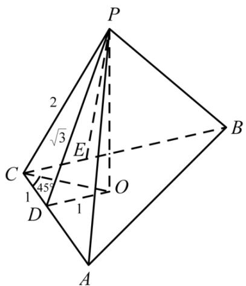

> [!faq]- 《专题13 立体几何的空间角与空间距离及其综合应用小题综合》真题解析
>
> > [!success]- **【答案】** 详见解析
>
> > [!note]- **【分析】**
> > 【分析】本题考查学生空间想象能力，合理画图成为关键，准确找到 P 在底面上的射影，使用线面垂直定理，得到垂直关系，勾股定理解决。
>
> > [!note]- **【解析】**
> > 【详解】作 $PD, PE$ 分别垂直于 $AC, BC$ ， $PO \perp$ 平面 $ABC$ ，连 $CO$ ，
> > 知 $CD \perp PD, CD \perp PO$ ， $PD \cap OD = P$
> > $\backslash CD^{\wedge}$ 平面 $PDO$ ， $OD \subset$ 平面 $PDO$
> > $\therefore CD \perp OD$
> > $\because PD = PE = \sqrt{3}, PC = 2 \therefore \sin \angle PCE = \sin \angle PCD = \frac{\sqrt{3}}{2}$
> > $$
> > \therefore \angle P C B = \angle P C A = 6 0 ^ {\circ}
> > $$
> > $\therefore PO \perp CO$ ，CO 为 $\angle ACB$ 平分线，
> > $\therefore \angle OCD = 45^{\circ} \therefore OD = CD = 1, OC = \sqrt{2}$ ，又 $PC = 2$
> > $\therefore PO = \sqrt{4 - 2} = \sqrt{2}$
> > 
> > 【点睛】画图视角选择不当，线面垂直定理使用不够灵活，难以发现垂直关系，问题即很难解决，将几何体摆放成正常视角，是立体几何问题解决的有效手段，几何关系利于观察，解题事半功倍。
