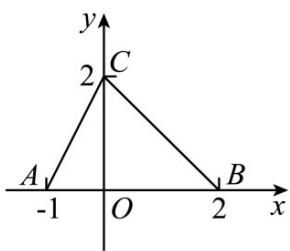

<!-- question-source:start -->
9.（2015·北京·高考真题）如图，函数 $f(x)$ 的图象为折线ACB，则不等式 $f(x)\log_{2}(x+1)$ 的解集是

A. $\{x\mid -1 <   x\leq 0\}$ B. $\{x\mid -1£x£1\}$ C. $\{x\mid -1 <   x\leq 1\}$ D. $\{x\mid -1 <   x\leq 2\}$
<!-- question-source:end -->

![[高中/真题/按题型分类/专题14 基本初等函数与图象零点应用/考点03_对数函数及其应用/对点训练/answers/Q00054930A1.md]]
