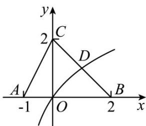

> [!faq]- 《zhenti-专题14 基本初等函数与图象零点应用》例题解析
>
> > [!success]- **【答案】** C
>
> > [!note]- **【解析】**
> > 试题分析：如下图所示，画出 $g(x) = \log_2(x + 1)$ 的函数图象，从而可知交点 $D(1,1)$ ，∴不等式 $f(x) \quad g(x)$ 的解集为 $(-1,1]$ ，故选C.
> >
> > 
> >
> > 考点： $^{1}$ ．对数函数的图象； $^{2}$ ．函数与不等式； $^{3}$ ．数形结合的数学思想．
