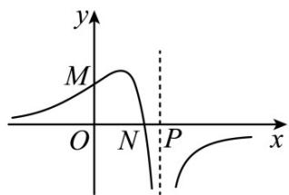

<!-- question-source:start -->
15. (2015·安徽·高考真题) 函数 $f(x) = \frac{ax + b}{(x + c)^2}$ 的图象如图所示，则下列结论成立的是

A. $a > 0$ ， $b > 0$ ， $c <   0$

B. $a <   0$ ， $b > 0$ ， $c > 0$

C. $a <   0$ ， $b > 0$ ， $c <   0$

D. $a <   0$ ， $b <   0$ ， $c <   0$
<!-- question-source:end -->

![[高中/真题/按题型分类/专题14 基本初等函数与图象零点应用/考点06_函数图象/对点训练/answers/Q00054969A1.md]]
