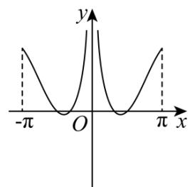
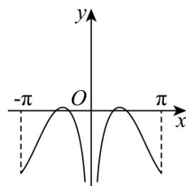
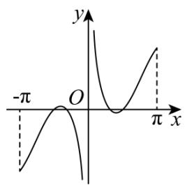
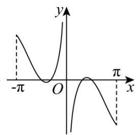

<!-- question-source:start -->
16. (2015·浙江·高考真题) 函数 $f(x) = \left( x - \frac{1}{x} \right) \cos x$ ( $-\pi \leq x \leq \pi$ 且 $x \neq 0$ ) 的图象可能为 ( )

A  

B

C

D  

<!-- question-source:end -->

![[高中/真题/按题型分类/专题14 基本初等函数与图象零点应用/考点06_函数图象/对点训练/answers/Q00054970A1.md]]
