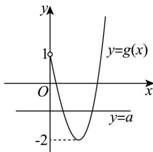

> [!faq]- 《zhenti-专题14 基本初等函数与图象零点应用》例题解析
>
> > [!success]- **【答案】** $(-2,1)$
>
> > [!note]- **【分析】**
> > 将函数转化为方程，令 $x^{3} - 3x = -(x - 1)^{2} + a$ ，分离参数 $a$ ，构造新函数 $g(x) = x^3 + x^2 - 5x + 1$ ，结合导数求得 $g(x)$ 单调区间，画出大致图形数形结合即可求解·
>
> > [!note]- **【解析】**
> > 令 $x^{3}-3x=-\left(x-1\right)^{2}+a$ ，即 $a=x^{3}+x^{2}-5x+1$ ，令 $g(x)=x^{3}+x^{2}-5x+1(x>0)$ ,
> >
> > 则 $g^{\prime}(x) = 3x^{2} + 2x - 5 = (3x + 5)(x - 1)$ ，令 $g^{\prime}(x) = 0(x > 0)$ 得 $x = 1$ ，
> >
> > 当 $x \in (0,1)$ 时， $g'(x) < 0$ ， $g(x)$ 单调递减，
> >
> > 当 $x \in (1, +\infty)$ 时， $g'(x) > 0$ ， $g(x)$ 单调递增， $g(0) = 1, g
> > (1) = -2$
> >
> > 因为曲线 $y = x^3 - 3x$ 与 $y = -(x - 1)^2 + a$ 在 $(0, +\infty)$ 上有两个不同的交点，
> >
> > 所以等价于 y = a 与 $g(x)$ 有两个交点，所以 $a \in (-2,1)$ .
> >
> > 
> >
> > 故答案为： $(-2,1)$
