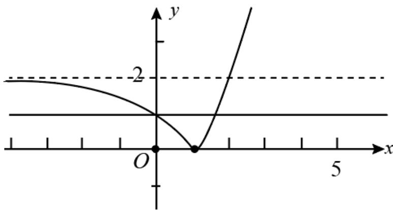

> [!faq]- 《zhenti-专题14 基本初等函数与图象零点应用》例题解析
>
> > [!success]- **【答案】** 0 < b < 2
>
> > [!note]- **【解析】**
> > 函数 $f(x) = \left|2^{x} - 2\right| - b$ 有两个零点，
> >
> > $y=\left|2^{x}-2\right|$ 和 y=b 的图象有两个交点，
> >
> > 画出 $y = \left|2^{x} - 2\right|$ 和 $y = b$ 的图象，如图，要有两个交点，那么 $b \in (0,2)$
> >
> > 
