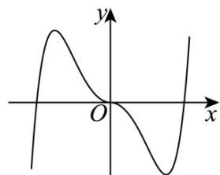
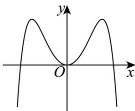
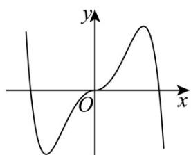
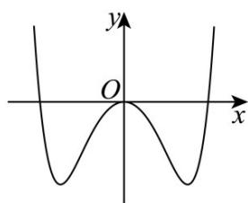

<!-- question-source:start -->
1. (2024·全国甲卷·高考真题) 函数 $f(x) = -x^2 + \left( e^x - e^{-x} \right) \sin x$ 在区间 $[-2.8, 2.8]$ 的图象大致为（）

A

B

C

D

<!-- question-source:end -->

![[高中/真题/按题型分类/专题14 指数、对数、幂函数、函数图象、函数零点及函数模型的应用/考点06_函数图象/真题/answers/Q00034646A1.md]]
