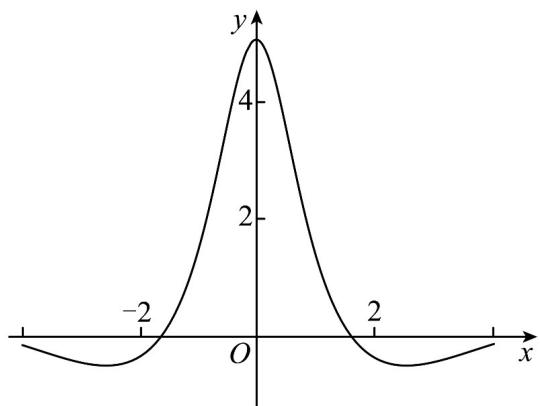

<!-- question-source:start -->
2.（2023·天津高考真题）已知函数 $f(x)$ 的部分图象如下图所示，则 $f(x)$ 的解析式可能为（）

A. $\frac{5\mathrm{e}^x - 5\mathrm{e}^{-x}}{x^2 + 2}$ B. $\frac{5\sin x}{x^2 + 1}$ C. $\frac{5\mathrm{e}^x + 5\mathrm{e}^{-x}}{x^2 + 2}$ D. $\frac{5\cos x}{x^2 + 1}$
<!-- question-source:end -->

![[高中/真题/按题型分类/专题14 指数、对数、幂函数、函数图象、函数零点及函数模型的应用/考点06_函数图象/真题/answers/Q00034647A1.md]]
