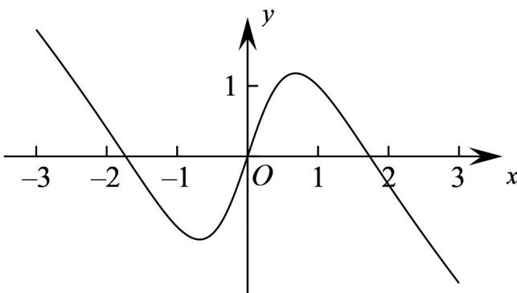

<!-- question-source:start -->
3. (2022·全国乙卷·高考真题) 如图是下列四个函数中的某个函数在区间 $[-3,3]$ 的大致图像，则该函数是（）

A. $y = \frac{-x^3 + 3x}{x^2 + 1}$ B. $y = \frac{x^3 - x}{x^2 + 1}$ C. $y = \frac{2x\cos x}{x^2 + 1}$ D. $y = \frac{2\sin x}{x^2 + 1}$
<!-- question-source:end -->

![[高中/真题/按题型分类/专题14 指数、对数、幂函数、函数图象、函数零点及函数模型的应用/考点06_函数图象/真题/answers/Q00034648A1.md]]
