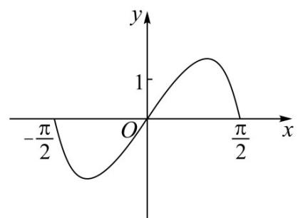
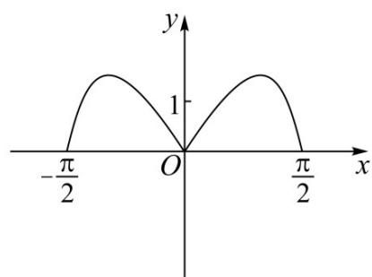
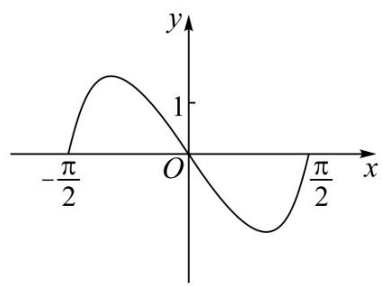
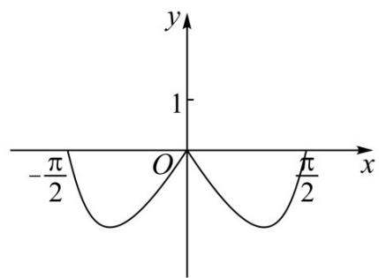

<!-- question-source:start -->
4.（2022·全国甲卷·高考真题）函数 $y = \left(3^{x} - 3^{-x}\right)\cos x$ 在区间 $\left[-\frac{\pi}{2},\frac{\pi}{2}\right]$ 的图象大致为（）

A

B

C

D

<!-- question-source:end -->

![[高中/真题/按题型分类/专题14 指数、对数、幂函数、函数图象、函数零点及函数模型的应用/考点06_函数图象/真题/answers/Q00034649A1.md]]
