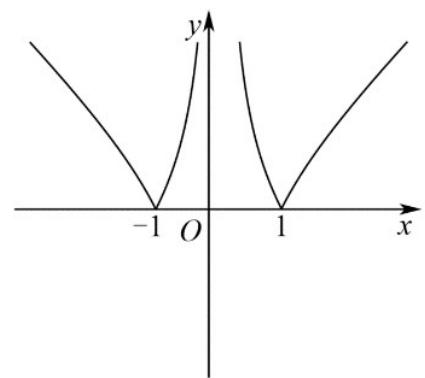
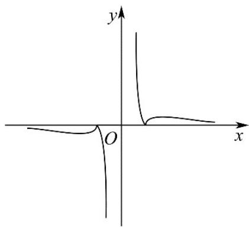
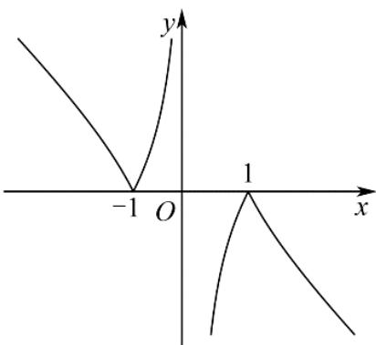
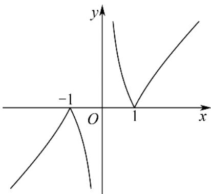

<!-- question-source:start -->
5.（2022·天津·高考真题）函数 $f(x) = \frac{|x^2 - 1|}{x}$ 的图像为（）

A

B

C

D

<!-- question-source:end -->

![[高中/真题/按题型分类/专题14 指数、对数、幂函数、函数图象、函数零点及函数模型的应用/考点06_函数图象/真题/answers/Q00034650A1.md]]
