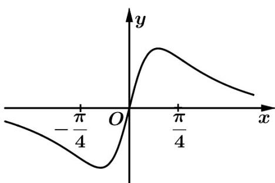

<!-- question-source:start -->
6. (2021·浙江·高考真题) 已知函数 $f(x) = x^2 + \frac{1}{4}, g(x) = \sin x$ ，则图象为如图的函数可能是（）

A. $y = f(x) + g(x) - \frac{1}{4}$ B. $y = f(x) - g(x) - \frac{1}{4}$

C. $y = f(x)g(x)$ D. $y = \frac{g(x)}{f(x)}$
<!-- question-source:end -->

![[高中/真题/按题型分类/专题14 指数、对数、幂函数、函数图象、函数零点及函数模型的应用/考点06_函数图象/真题/answers/Q00034651A1.md]]
