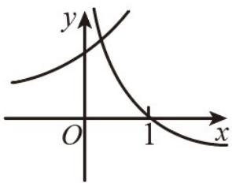
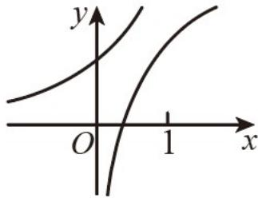
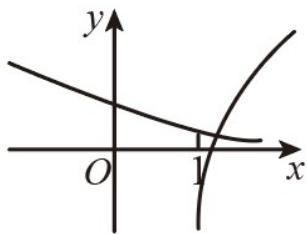
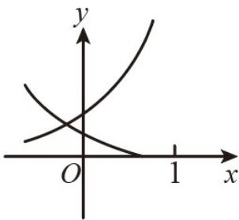

<!-- question-source:start -->
9. (2019·浙江·高考真题) 在同一直角坐标系中，函数 $y = \frac{1}{a^x}, y = \log_a\left(x + \frac{1}{2}\right) (a > 0 \text{且 } a \neq 1)$ 的图象可能是

A.

B

C

D

<!-- question-source:end -->

![[高中/真题/按题型分类/专题14 指数、对数、幂函数、函数图象、函数零点及函数模型的应用/考点06_函数图象/真题/answers/Q00034654A1.md]]
