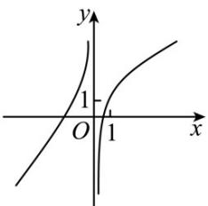
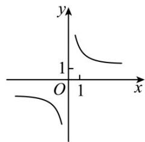
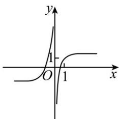
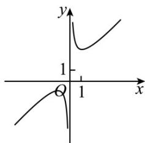

<!-- question-source:start -->
14. (2017·全国·高考真题) 函数 $y = 1 + x + \frac{\sin x}{x^2}$ 的部分图象大致为（）

A

B

C

D

<!-- question-source:end -->

![[高中/真题/按题型分类/专题14 指数、对数、幂函数、函数图象、函数零点及函数模型的应用/考点06_函数图象/真题/answers/Q00034659A1.md]]
