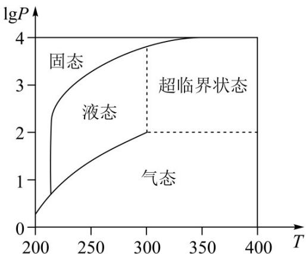

<!-- question-source:start -->
2．（2022·北京·高考真题）在北京冬奥会上，国家速滑馆“冰丝带”使用高效环保的二氧化碳跨临界直冷制冰技术，为实现绿色冬奥作出了贡献．如图描述了一定条件下二氧化碳所处的状态与T和 $\lg P$ 的关系，其中T表示温度，单位是K；P表示压强，单位是bar．下列结论中正确的是（）

A. 当 $T = 220$ ， $P = 1026$ 时，二氧化碳处于液态
B. 当 $T = 270$ ， $P = 128$ 时，二氧化碳处于气态
C. 当 $T = 300$ ， $P = 9987$ 时，二氧化碳处于超临界状态
D. 当 $T = 360$ ， $P = 729$ 时，二氧化碳处于超临界状态
<!-- question-source:end -->

![[高中/真题/按题型分类/专题14 指数、对数、幂函数、函数图象、函数零点及函数模型的应用/考点07_函数零点及其应用/真题/answers/Q00034696A1.md]]
