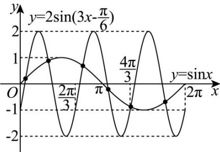

> [!faq]- 《专题14 指数、对数、幂函数、函数图象、函数零点及函数模型的应用》真题解析
>
> > [!success]- **【答案】** C
>
> > [!note]- **【分析】**
> > 【分析】画出两函数在 $[0,2\pi]$ 上的图象，根据图象即可求解
>
> > [!note]- **【解析】**
> > 【详解】因为函数 $y = \sin x$ 的的最小正周期为 $T = 2\pi$
> > 函数 $y = 2\sin \left(3x - \frac{\pi}{6}\right)$ 的最小正周期为 $T = \frac{2\pi}{3}$ ，
> > 所以在 $x \in [0, 2\pi]$ 上函数 $y = 2\sin \left(3x - \frac{\pi}{6}\right)$ 有三个周期的图象，
> > 在坐标系中结合五点法画出两函数图象，如图所示：
> > 
> > 由图可知，两函数图象有 $^{6}$ 个交点·
> >
> > 故选 **C**
