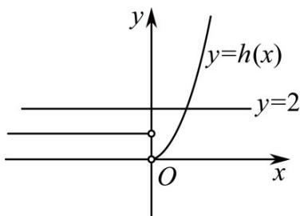
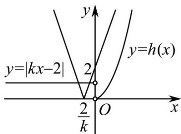
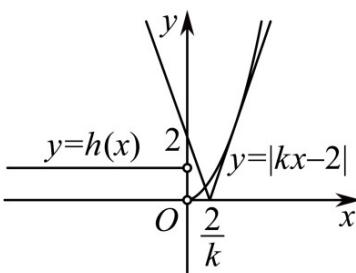

> [!faq]- 《专题14 指数、对数、幂函数、函数图象、函数零点及函数模型的应用》真题解析
>
> > [!success]- **【答案】** B
>
> > [!note]- **【分析】**
> > 由 $x^{2} - 2(a + 1)x + a^{2} + 5 = 0$ 最多有2个根，可得 $\cos (2\pi x - 2\pi a) = 0$ 至少有4个根，分别讨论当 $x <   a$ 和 $x\quad a$ 时两个函数零点个数情况，再结合考虑即可得出·
>
> > [!note]- **【解析】**
> > $\because x^{2} - 2(a + 1)x + a^{2} + 5 = 0$ 最多有2个根，所以 $\cos (2\pi x - 2\pi a) = 0$ 至少有4个根，
> > 由 $2\pi x - 2\pi a = \frac{\pi}{2} + k\pi, k \in Z$ 可得 $x = \frac{k}{2} + \frac{1}{4} + a, k \in Z$
> > 由 $0 < \frac{k}{2} + \frac{1}{4} + a < a$ 可得 $-2a - \frac{1}{2} < k < -\frac{1}{2}$
> > (1) $x < a$ 时，当 $-5 \leq -2a - \frac{1}{2} < -4$ 时， $f(x)$ 有 $^4$ 个零点，即 $\frac{7}{4} < a \leq \frac{9}{4}$ ；
> > 当 $-6 \leq -2a - \frac{1}{2} < -5$ ， $f(x)$ 有 $^{5}$ 个零点，即 $\frac{9}{4} < a \leq \frac{11}{4}$ ；
> > 当 $-7 \leq -2a - \frac{1}{2} < -6$ ， $f(x)$ 有 $6$ 个零点，即 $\frac{11}{4} < a \leq \frac{13}{4}$ ；
> > (2) 当 x a 时， $f(x)=x^{2}-2(a+1)x+a^{2}+5$
> > $$
> > \Delta = 4 (a + 1) ^ {2} - 4 \left(a ^ {2} + 5\right) = 8 (a - 2)
> > $$
> > 当 $a < 2$ 时， $\Delta < 0$ ， $f(x)$ 无零点；
> > 当 $a = 2$ 时， $\Delta = 0$ ， $f(x)$ 有1个零点；
> > 当 $a > 2$ 时，令 $f(a) = a^2 - 2a(a + 1) + a^2 + 5 = -2a + 5 \quad 0$ ，则 $2 < a \leq \frac{5}{2}$ ，此时 $f(x)$ 有 $^2$ 个零点；
> > 所以若 $a > \frac{5}{2}$ 时， $f(x)$ 有1个零点·
> > 综上，要使 $f(x)$ 在区间 $(0, +\infty)$ 内恰有6个零点，则应满足$\left\{ \begin{array}{l} \frac{7}{4} < a \leq \frac{9}{4} \\ 2 < a \leq \frac{5}{2} \end{array} \right.$ 或 $\left\{ \begin{array}{l} \frac{9}{4} < a \leq \frac{11}{4} \\ a = 2 \text{或} a > \frac{5}{2} \end{array} \right.$ 或 $\left\{ \begin{array}{l} \frac{11}{4} < a \leq \frac{13}{4} \\ a < 2 \end{array} \right.,$
> > 则可解得 a 的取值范围是 $\left(2,\frac{9}{4}\right]\cup\left(\frac{5}{2},\frac{11}{4}\right]$ .
> > 【点睛】关键点睛：解决本题的关键是分成 $x < a$ 和 $x - a$ 两种情况分别讨论两个函数的零点个数情况·5．（2020·天津·高考真题）已知函数 $f(x) = \begin{cases} x^3, & x..0, \\ -x, & x < 0. \end{cases}$ 若函数 $g(x) = f(x) - |kx^2 - 2x|$ （ $k \in \mathbf{R}$ ）恰有4个零点，则 $k$ 的取值范围是（）A． $\left(-\infty, -\frac{1}{2}\right) \cup (2\sqrt{2}, +\infty)$ B． $\left(-\infty, -\frac{1}{2}\right) \cup (0, 2\sqrt{2})$ C． $(- \infty, 0) \cup (0, 2\sqrt{2})$ D． $(- \infty, 0) \cup (2\sqrt{2}, +\infty)$
> > 【答案】D
> > 【分析】由 $g(0)=0$ ，结合已知，将问题转化为 $y=|kx-2|$ 与 $h(x)=\frac{f(x)}{|x|}$ 有 3 个不同交点，分 k=0, k<0, k>0 三种情况，数形结合讨论即可得到答案。
> > 【详解】注意到 $g(0)=0$ ，所以要使 $g(x)$ 恰有 4 个零点，只需方程 $|kx-2|= \frac{f(x)}{|x|}$ 恰有 3 个实根即可，
> > 令 $h(x)=\frac{f(x)}{|x|}$ ，即 $y=|kx-2|$ 与 $h(x)=\frac{f(x)}{|x|}$ 的图象有 3 个不同交点。
> > 因为 $h(x)=\frac{f(x)}{|x|}=\left\{\begin{aligned}&x^{2},&x>0\\ &1,&x<0\end{aligned}\right.$ 当 k=0 时，此时 y=2 ，如图 $^{1}$ ，y=2 与 $h(x)=\frac{f(x)}{|x|}$ 有 1 个不同交点，不满足题意；
> > 当 k<0 时，如图 $^{2}$ ，此时 $y=|kx-2|$ 与 $h(x)=\frac{f(x)}{|x|}$ 恒有 3 个不同交点，满足题意；
> > 当 k>0 时，如图 $^{3}$ ，当 y=kx-2 与 $y=x^{2}$ 相切时，联立方程得 $x^{2}-kx+2=0$ ，
> > 令 $\Delta=0$ 得 $k^{2}-8=0$ ，解得 $k=2\sqrt{2}$ （负值舍去），所以 $k>2\sqrt{2}$ .
> > 综上，k 的取值范围为 $(-∞,0)∪(2√2,+∞)$ .
> > 故选：D.
> > 
> > 图1
> > 
> > 图2
> > 
> > 图3
> > 【点睛】本题主要考查函数与方程的应用，考查数形结合思想，转化与化归思想，是一道中档题6．（2019·全国·高考真题）函数 $f(x)=2\sin x-\sin 2x$ 在 $[0,2\pi]$ 的零点个数为
> > A. 2 B. 3 C. 4 D. 5
> > 【答案】B
> > 【解析】令 $f(x) = 0$ ，得 $\sin x = 0$ 或 $\cos x = 1$ ，再根据 $x$ 的取值范围可求得零点
> > 【详解】由 $f(x) = 2\sin x - \sin 2x = 2\sin x - 2\sin x\cos x = 2\sin x(1 - \cos x) = 0$
> > 得 $\sin x = 0$ 或 $\cos x = 1$ ， $\because x \in [0, 2\pi]$
> > $\therefore x = 0, \pi$ 或 $2\pi$
> > $\therefore f(x)$ 在 $[0,2\pi ]$ 的零点个数是3，
> > 故选 B.
> > 【点睛】本题考查在一定范围内的函数的零点个数，渗透了直观想象和数学运算素养．采取特殊值法，利用数形结合和方程思想解题．
