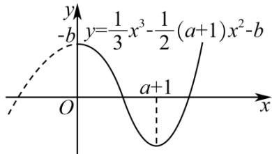

> [!faq]- 《专题14 指数、对数、幂函数、函数图象、函数零点及函数模型的应用》真题解析
>
> > [!success]- **【答案】** C
>
> > [!note]- **【分析】**
> > 当 $x < 0$ 时， $y = f(x) - ax - b = x - ax - b = (1 - a)x - b$ 最多一个零点；当 $x = 0$ 时， $y = f(x) - ax - b = \frac{1}{3} x^3 - \frac{1}{2}(a + 1)x^2 + ax - ax - b = \frac{1}{3} x^3 - \frac{1}{2}(a + 1)x^2 - b$ ，利用导数研究函数的单调性，根据单调性画函数草图，根据草图可得。
>
> > [!note]- **【解析】**
> > 当 $x < 0$ 时， $y = f(x) - ax - b = x - ax - b = (1 - a)x - b = 0$ ，得 $x = \frac{b}{1 - a}$ ； $y = f(x) - ax - b$ 最多一个零点；
> > 当 $x$ 0时， $y = f(x) - ax - b = \frac{1}{3} x^3 - \frac{1}{2}(a + 1)x^2 + ax - ax - b = \frac{1}{3} x^3 - \frac{1}{2}(a + 1)x^2 - b$
> > $$
> > y ^ {\prime} = x ^ {2} - (a + 1) x
> > $$
> > 当 $a + 1 \leq 0$ ，即 $a \leq -1$ 时， $y' = 0$ ， $y = f(x) - ax - b$ 在 $[0, +\infty)$ 上递增， $y = f(x) - ax - b$ 最多一个零点。不合题意；
> > 当 $a + 1 > 0$ ，即 $a > -1$ 时，令 $y' > 0$ 得 $x \in [a + 1, +\infty)$ ，函数递增，令 $y' < 0$ 得 $x \in [0, a + 1)$ ，函数递减；函数最多有2个零点；
> > 根据题意函数 $y = f(x) - ax - b$ 恰有3个零点 $\Leftrightarrow$ 函数 $y = f(x) - ax - b$ 在 $(- \infty, 0)$ 上有一个零点，在 $[0, +\infty)$ 上有2个零点，
> > 如图：
> > $\therefore \frac{b}{1-a}<0$ 且 $\left\{\begin{aligned}-b&>0\\ \frac{1}{3}(a+1)^{3}&-\frac{1}{2}(a+1)(a+1)^{2}-b<0\end{aligned}\right.$
> > 解得 $b < 0$ ， $1 - a > 0$ ， $0 > b > -\frac{1}{6} (a + 1)^3, \therefore 1 > a > -1$
> > 故选C.
> > 
> > 【点睛】遇到此类问题，不少考生会一筹莫展·由于方程中涉及 $a, b$ 两个参数，故按“一元化”想法，逐步分
> > 类讨论，这一过程中有可能分类不全面、不彻底·
