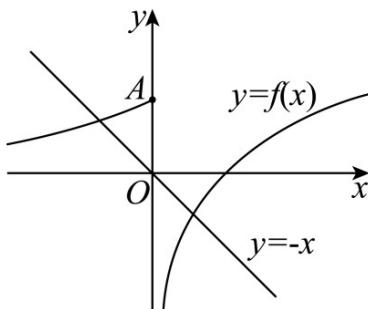

> [!faq]- 《专题14 指数、对数、幂函数、函数图象、函数零点及函数模型的应用》真题解析
>
> > [!success]- **【答案】** C
>
> > [!note]- **【分析】**
> > 本题未单列分析。
>
> > [!note]- **【解析】**
> > 【答案】C
> > 【详解】分析：首先根据 $g(x)$ 存在 $^2$ 个零点，得到方程 $f(x) + x + a = 0$ 有两个解，将其转化为 $f(x) = -x - a$ 有两个解，即直线 $y = -x - a$ 与曲线 $y = f(x)$ 有两个交点，根据题中所给的函数解析式，画出函数 $f(x)$ 的图像（将 $e^x (x > 0)$ 去掉），再画出直线 $y = -x$ ，并将其上下移动，从图中可以发现，当 $-a \leq 1$ 时，满足 $y = -x - a$ 与曲线 $y = f(x)$ 有两个交点，从而求得结果·
> > 详解：画出函数 $f(x)$ 的图像， $y = e^x$ 在 $\mathsf{Y}$ 轴右侧的去掉，
> > 再画出直线 $y = -x$ ，之后上下移动，
> > 可以发现当直线过点 $\mathsf{A}$ 时，直线与函数图像有两个交点，
> > 并且向下可以无限移动，都可以保证直线与函数的图像有两个交点，
> > 即方程 $f(x) = -x - a$ 有两个解，
> > 也就是函数 $g(x)$ 有两个零点，
> > 此时满足 $-a \leq 1$ ，即 $a - 1$ ，故选 C.
> > 
> > 点睛：该题考查的是有关已知函数零点个数求有关参数的取值范围问题，在求解的过程中，解题的思路是将函数零点个数问题转化为方程解的个数问题，将式子移项变形，转化为两条曲线交点的问题，画出函数的图像以及相应的直线，在直线移动的过程中，利用数形结合思想，求得相应的结果。
