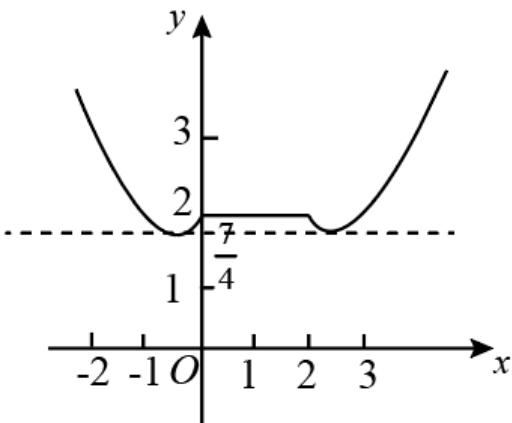

> [!faq]- 《专题14 指数、对数、幂函数、函数图象、函数零点及函数模型的应用》真题解析
>
> > [!success]- **【答案】** D
>
> > [!note]- **【分析】**
> > 本题未单列分析。
>
> > [!note]- **【解析】**
> > 【答案】D
> > 【详解】函数 $y = f(x) - g(x)$ 恰有4个零点，即方程 $f(x) - g(x) = 0$ ，即 $b = f(x) + f(2 - x)$ 有4个不同的实数根，
> > 即直线 $y = b$ 与函数 $y = f(x) + f(2 - x)$ 的图象有四个不同的交点.
> > 又 $y = f(x) + f(2 - x) = \begin{cases} x^{2} + x + 2, & x < 0 \\ 2, & 0 \leq x \leq 2 \\ x^{2} - 5x + 8, & x > 2 \end{cases}$
> > 做出该函数的图象如图所示，
> > 
> > 由图得，当 $\frac{7}{4} < b < 2$ 时，直线 $y = b$ 与函数 $y = f(x) + f(2 - x)$ 的图象有4个不同的交点，
> > 故函数 $y = f(x) - g(x)$ 恰有 4 个零点时，
> > b 的取值范围是 $\left(\frac{7}{4},2\right)$ 故选 D.
> > 考点： $^{1}$ 、分段函数； $^{2}$ 、函数的零点。
> > 【方法点睛】本题主要考查的是分段函数和函数的零点，属于难题．已知函数的零点个数，一般利用数形结合思想转化为两个函数的图像的交点个数问题，作图时一定要保证图形准确，否则很容易出现错误．
