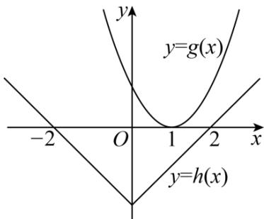
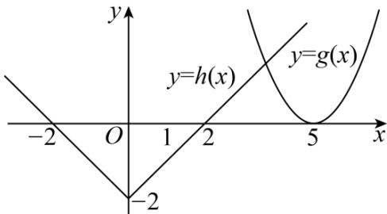

> [!faq]- 《专题14 指数、对数、幂函数、函数图象、函数零点及函数模型的应用》真题解析
>
> > [!success]- **【答案】** $a$ 10
>
> > [!note]- **【分析】**
> > 设 $g(x)=x^{2}-ax+3a-5$ ， $h(x)=|x|-2$ ，分析可知函数 $g(x)$ 至少有一个零点，可得出 $\Delta0$ ，求出 a 的取值范围，然后对实数 a 的取值范围进行分类讨论，根据题意可得出关于实数 a 的不等式，综合可求得实数 a 的取值范围。
>
> > [!note]- **【解析】**
> > 设 $g(x)=x^{2}-ax+3a-5$ ， $h(x)=|x|-2$ ，由 $|x|-2=0$ 可得 $x=\pm2$ .
> > 要使得函数 $f(x)$ 至少有3个零点，则函数 $g(x)$ 至少有一个零点，则 $\Delta = a^2 - 12a + 20 \quad 0$ ，
> > 解得 $a \leq 2$ 或 a 10.
> > - **①**：当 a=2 时， $g(x)=x^{2}-2x+1$ ，作出函数 $g(x)$ 、 $h(x)$ 的图象如下图所示：
> > 
> > 此时函数 $f(x)$ 只有两个零点，不合乎题意；
> > - **②**：当 a < 2 时，设函数 $g(x)$ 的两个零点分别为 $x_{1}$ 、 $x_{2}(x_{1} < x_{2})$
> > 要使得函数 $f(x)$ 至少有 3 个零点，则 $x_{2} \leq -2$ ，
> > 所以， $\left\{\begin{aligned}\frac{a}{2}&<-2\\ g(-2)&=4+5a-5\quad0\end{aligned}\right.$ ，解得； $a\in\varnothing$
> > - **③**：当 $a = 10$ 时， $g(x) = x^2 - 10x + 25$ ，作出函数 $g(x)$ 、 $h(x)$ 的图象如下图所示：
> > 
> > 由图可知，函数 $f(x)$ 的零点个数为3，合乎题意；
> > - **④**：当 $a > 10$ 时，设函数 $g(x)$ 的两个零点分别为 $x_{3}$ 、 $x_{4}(x_{3} < x_{4})$
> > 要使得函数 $f(x)$ 至少有3个零点，则 $x_{3} = 2$
> > 可得 $\left\{\begin{aligned}\frac{a}{2}&>2\\ g(2)&=4+a-5\quad0\end{aligned}\right.$ ，解得，此时 $a>4$ ，此时 $a>10$
> > 综上所述，实数 a 的取值范围是 $\left[10, +\infty\right)$ .
> > 故答案为： $\left[10,+\infty\right)$ .
> > 【点睛】方法点睛：已知函数有零点（方程有根）求参数值（取值范围）常用的方法：
> > (1) 直接法：直接求解方程得到方程的根，再通过解不等式确定参数范围；
> > (2) 分离参数法：先将参数分离，转化成求函数的值域问题加以解决；
> > (3) 数形结合法：先对解析式变形，进而构造两个函数，然后在同一平面直角坐标系中画出函数的图象，利用数形结合的方法求解.
