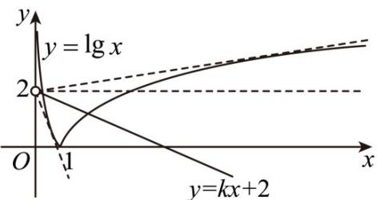

> [!faq]- 《专题14 指数、对数、幂函数、函数图象、函数零点及函数模型的应用》真题解析
>
> > [!success]- **【答案】** ①②④
>
> > [!note]- **【分析】**
> > 由 $f(x) = 0$ 可得出 $|\lg x| = kx + 2$ ，考查直线 $y = kx + 2$ 与曲线 $g(x) = |\lg x|$ 的左、右支分别相切的情形，利用方程思想以及数形结合可判断各选项的正误·
>
> > [!note]- **【解析】**
> > - **对于①**：，当 $k = 0$ 时，由 $f(x) = |\lg x| - 2 = 0$ ，可得 $x = \frac{1}{100}$ 或 $x = 100$ ，①正确；
> > - **对于②**：，考查直线 $y = kx + 2$ 与曲线 $y = -\lg x (0 < x < 1)$ 相切于点 $P(t, -\lg t)$
> > 对函数 求导得 $y' = -\frac{1}{x \ln 10}$ ，由题意可得 $\left\{\begin{aligned}&kt+2=-\lg t\\ &k=-\frac{1}{t \ln 10}\end{aligned}\right.$ ，解得 $\left\{\begin{aligned}&t=\frac{e}{100}\\ &k=-\frac{100}{e}\lg e\end{aligned}\right.$
> > 所以，存在 $k = -\frac{100}{e}\lg e < 0$ ，使得 $f(x)$ 只有一个零点，②正确；
> > - **对于③**：，当直线 $y = kx + 2$ 过点（1,0）时， $k + 2 = 0$ ，解得 $k = -2$ ，
> > 所以，当 $-\frac{100}{e}\lg e < k < -2$ 时，直线 $y = kx + 2$ 与曲线 $y = -\lg x(0 < x < 1)$ 有两个交点，
> > 若函数 $f(x)$ 有三个零点，则直线 $y = kx + 2$ 与曲线 $y = -\lg x (0 < x < 1)$ 有两个交点，
> > 直线 与曲线 有一个交点，所以， $\left\{\begin{aligned}-\frac{100}{e}\lg e&<k<-2\\ k&+2>0\end{aligned}\right.$ ，此不等式无解，
> > 因此，不存在 $k < 0$ ，使得函数 $f(x)$ 有三个零点，③错误；
> > - **对于④**：，考查直线 $y = kx + 2$ 与曲线 $y = \lg x (x > 1)$ 相切于点 $P(t, \lg t)$ ，
> > 对函数 $y = \lg x$ 求导得 $y' = \frac{1}{x \ln 10}$ ，由题意可得 $\left\{\begin{aligned}&kt + 2 = \lg t\\ &k = \frac{1}{t \ln 10}\end{aligned}\right.$ ，解得 $\left\{\begin{aligned}&t = 100e\\ &k = \frac{\lg e}{100e}\end{aligned}\right.$
> > 所以，当 $0 < k < \frac{\lg e}{100e}$ 时，函数 $f(x)$ 有三个零点，④正确·
> > 
> > 故答案为：①②④·
> > 【点睛】思路点睛：已知函数的零点或方程的根的情况，求解参数的取值范围问题的本质都是研究函数的零点问题，求解此类问题的一般步骤：
> > (1) 转化，即通过构造函数，把问题转化成所构造函数的零点问题；
> > (2) 列式，即根据函数的零点存在定理或结合函数的图象列出关系式；
> > (3) 得解，即由列出的式子求出参数的取值范围。
