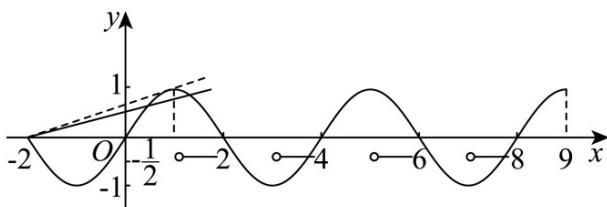

> [!faq]- 《专题14 指数、对数、幂函数、函数图象、函数零点及函数模型的应用》真题解析
>
> > [!success]- **【答案】** $\left[\frac{1}{3},\frac{\sqrt{2}}{4}\right)$ .
>
> > [!note]- **【分析】**
> > 分别考查函数 $f(x)$ 和函数 $g(x)$ 图像的性质，考查临界条件确定 $k$ 的取值范围即可.
>
> > [!note]- **【解析】**
> > 当 $x \in (0,2]$ 时， $f(x) = \sqrt{1 - (x - 1)^2}$ ，即 $(x - 1)^2 + y^2 = 1, y = 0$ .
> > 又 $f(x)$ 为奇函数，其图象关于原点对称，其周期为4，如图，函数 $f(x)$ 与 $g(x)$ 的图象，要使 $f(x) = g(x)$ 在 $(0,9]$ 上有8个实根，只需二者图象有8个交点即可·
> > 
> > 当 $g(x) = -\frac{1}{2}$ 时，函数 $f(x)$ 与 $g(x)$ 的图象有2个交点；
> > 当 $g(x) = k(x + 2)$ 时， $g(x)$ 的图象为恒过点 $(-2,0)$ 的直线，只需函数 $f(x)$ 与 $g(x)$ 的图象有6个交点·当 $f(x)$ 与 $g(x)$ 图象相切时，圆心 $(1,0)$ 到直线 $kx - y + 2k = 0$ 的距离为 $1$ ，即 $\frac{|k + 2k|}{\sqrt{1 + k^2}} = 1$ ，得 $k = \frac{\sqrt{2}}{4}$ ，函数 $f(x)$ 与 $g(x)$ 的图象有3个交点；当 $g(x) = k(x + 2)$ 过点 $(1,1)$ 时，函数 $f(x)$ 与 $g(x)$ 的图象有6个交点，此时 $1 = 3k$ ，得 $k = \frac{1}{3}$ .
> > 综上可知，满足 $f(x) = g(x)$ 在 $(0,9]$ 上有8个实根的 $k$ 的取值范围为 $\left[\frac{1}{3},\frac{\sqrt{2}}{4}\right)$ .
> > 【点睛】本题考点为参数的取值范围，侧重函数方程的多个实根，难度较大·不能正确画出函数图象的交点而致误，根据函数的周期性平移图象，找出两个函数图象相切或相交的临界交点个数，从而确定参数的取值范围·
