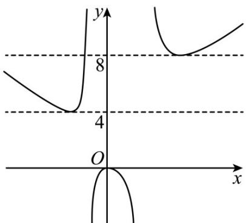

> [!faq]- 《专题14 指数、对数、幂函数、函数图象、函数零点及函数模型的应用》真题解析
>
> > [!success]- **【答案】** (4,8)
>
> > [!note]- **【分析】**
> > 本题未单列分析。
>
> > [!note]- **【解析】**
> > 分析：由题意分类讨论 $x \leq 0$ 和 $x > 0$ 两种情况，然后绘制函数图像，数形结合即可求得最终结果。详解：分类讨论：当 $x \leq 0$ 时，方程 $f(x) = ax$ 即 $x^2 + 2ax + a = ax$ ，
> > 整理可得： $x^{2} = -a(x + 1)$
> > 很明显 $x = -1$ 不是方程的实数解，则 $a = -\frac{x^2}{x + 1}$
> > 当 $x > 0$ 时，方程 $f(x) = ax$ 即 $-x^{2} + 2ax - 2a = ax$
> > 整理可得： $x^{2} = a(x - 2)$
> > 很明显 $x = 2$ 不是方程的实数解，则 $a = \frac{x^2}{x - 2}$
> > 令 $g(x) = \left\{ \begin{array}{l} -\frac{x^2}{x + 1},x\leq 0\\ \frac{x^2}{x - 2},x > 0 \end{array} \right.$
> > 其中 $-\frac{x^2}{x + 1} = -\left(x + 1 + \frac{1}{x + 1} -2\right)$ ， $\frac{x^2}{x - 2} = x - 2 + \frac{4}{x - 2} +4$
> > 原问题等价于函数 $g(x)$ 与函数 $y = a$ 有两个不同的交点，求 $a$ 的取值范围
> > 结合对勾函数和函数图象平移的规律绘制函数 $g(x)$ 的图象，
> > 同时绘制函数 y = a 的图象如图所示，考查临界条件，
> > 结合 a > 0 观察可得，实数 a 的取值范围是 $(4,8)$ .
> > 
> > 点睛：本题的核心在考查函数的零点问题，函数零点的求解与判断方法包括：
> > (1) 直接求零点：令 $f(x) = 0$ ，如果能求出解，则有几个解就有几个零点。
> > (2)零点存在性定理：利用定理不仅要函数在区间 $[a, b]$ 上是连续不断的曲线，且 $f(a) \cdot f(b) < 0$ ，还必须结合函数的图象与性质（如单调性、奇偶性）才能确定函数有多少个零点。
> > (3)利用图象交点的个数：将函数变形为两个函数的差，画两个函数的图象，看其交点的横坐标有几个不同的值，就有几个不同的零点。
