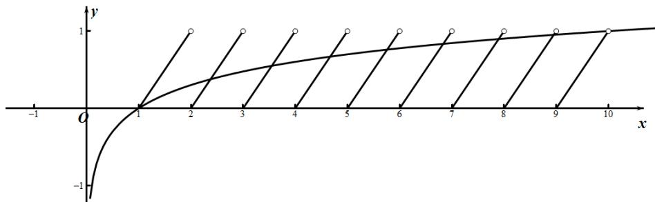

> [!faq]- 《专题14 指数、对数、幂函数、函数图象、函数零点及函数模型的应用》真题解析
>
> > [!success]- **【答案】** 详见解析
>
> > [!note]- **【分析】**
> > 本题未单列分析。
>
> > [!note]- **【解析】**
> > 【答案】8
> > 【详解】由于 $f(x)\in [0,1)$ ，则需考虑 $1\leq x < 10$ 的情况，
> > 在此范围内， $x \in Q$ 且 $x \in D$ 时，设 $x = \frac{q}{p}, p, q \in N^{*}, p = 2$ ，且 p, q 互质，
> > 若 $\lg x\in Q$ ，则由 $\lg x\in (0,1)$ ，可设 $\lg x = \frac{n}{m},m,n\in \mathbf{N}^*,m - 2$ ，且 $m,n$ 互质，
> > 因此 $10^{\frac{n}{m}} = \frac{q}{p}$ ，则 $10^{n} = (\frac{q}{p})^{m}$ ，此时左边为整数，右边为非整数，矛盾，因此 $\lg x \notin \mathbf{Q}$ ，
> > 因此 $\lg x$ 不可能与每个周期内 $x \in D$ 对应的部分相等，
> > 只需考虑 $\lg x$ 与每个周期 $x \notin D$ 的部分的交点，
> > 画出函数图象，图中交点除外 $(1,0)$ 其他交点横坐标均为无理数，属于每个周期 $x\notin D$ 的部分，
> > 且 $x = 1$ 处 $(\lg x)' = \frac{1}{x\ln 10} = \frac{1}{\ln 10} < 1$ ，则在 $x = 1$ 附近仅有一个交点，
> > 因此方程 $f(x)-\lg x=0$ 的解的个数为 8 .
> > 
> > 点睛:对于方程解的个数(或函数零点个数)问题，可利用函数的值域或最值，结合函数的单调性、草图确定其中参数范围．从图象的最高点、最低点，分析函数的最值、极值；从图象的对称性，分析函数的奇偶性；从图象的走向趋势，分析函数的单调性、周期性等。
