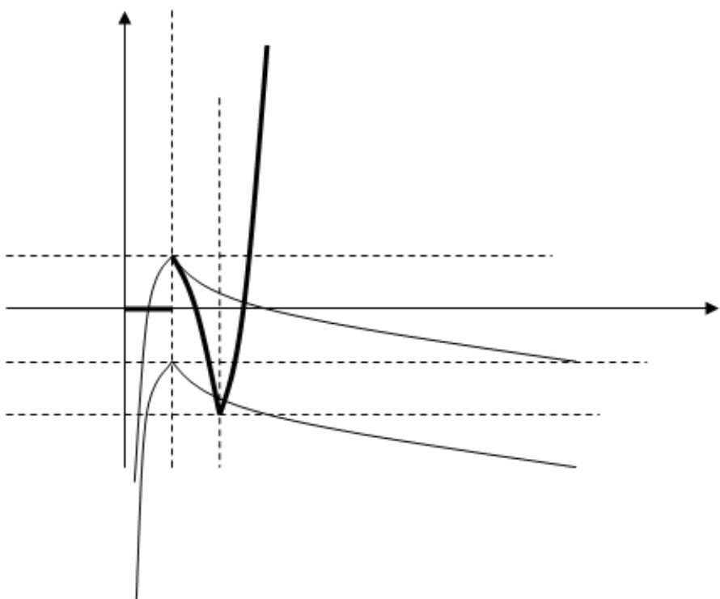
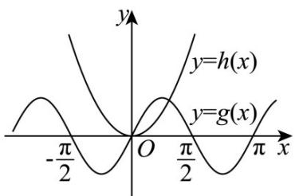

> [!faq]- 《专题14 指数、对数、幂函数、函数图象、函数零点及函数模型的应用》真题解析
>
> > [!success]- **【答案】** 4
>
> > [!note]- **【分析】**
> > 本题未单列分析。
>
> > [!note]- **【解析】**
> > 试题分析：如图 $y = g(x)$ 与 $y = \pm 1 - f(x)$ 交点个数为4【思路点睛】（ $^{1}$ ）运用函数图象解决问题时，先要正确理解和把握函数图象本身的含义及其表示的内容，熟悉图象所能够表达的函数的性质·
> > 
> > 考点：函数图像
> > (2) 在研究函数性质特别是单调性、最值、零点时，要注意用好其与图象的关系，结合图象研究·32．(2015·湖北·高考真题）函数 $f(x)=2\sin x\sin\left(x+\frac{\pi}{2}\right)-x^{2}$ 的零点个数为 \_\_\_\_。
> > 【答案】2.
> > 【详解】函数 $f(x) = 2\sin x\sin \left(x + \frac{\pi}{2}\right) - x^2$ 的零点个数等价于方程 $2\sin x\sin \left(x + \frac{\pi}{2}\right) - x^2 = 0$ 的根的个数，即函数 $g(x) = 2\sin x\sin \left(x + \frac{\pi}{2}\right) = 2\sin x\cos x = \sin 2x$ 与 $h(x) = x^2$ 的图象交点个数。
> > 于是，分别画出其函数图像如下图所示，由图可知，函数 $g(x)$ 与 $h(x)$ 的图象有2个交点.
> > 
