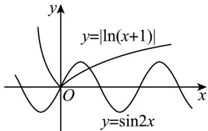

> [!faq]- 《专题14 指数、对数、幂函数、函数图象、函数零点及函数模型的应用》真题解析
>
> > [!success]- **【答案】** 详见解析
>
> > [!note]- **【分析】**
> > 本题未单列分析。
>
> > [!note]- **【解析】**
> > 【答案】2
> > 【详解】因为 $f(x) = 4\cos^2{\frac{x}{2}}\cos \left(\frac{\pi}{2} -x\right) - 2\sin x - |\ln (x + 1)|$
> > $$
> > = 2 (1 + \cos x) \sin x - 2 \sin x - | \ln (x + 1) |
> > $$
> > $$
> > = \sin 2 x - | \ln (x + 1) |
> > $$
> > 所以函数 $f(x)$ 的零点个数为函数 $y = \sin 2x$ 与 $y = |\ln (x + 1)|$ 图象的交点的个数，
> > 函数 $y = \sin 2x$ 与 $y = |\ln (x + 1)|$ 图象如图，由图知，两函数图象有2个交点，
> > 所以函数 $f(x)$ 有 2 个零点.
> > 
> > 考点：二倍角的正弦、余弦公式，诱导公式，函数的零点。
