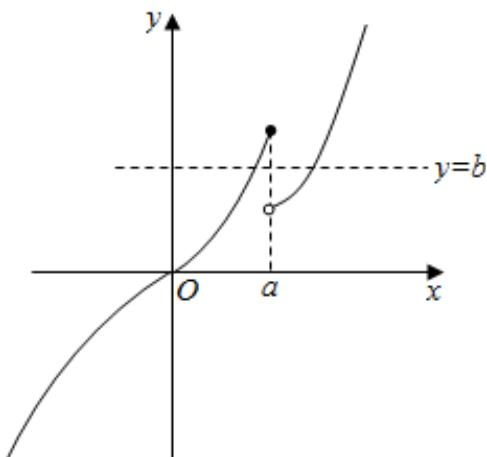
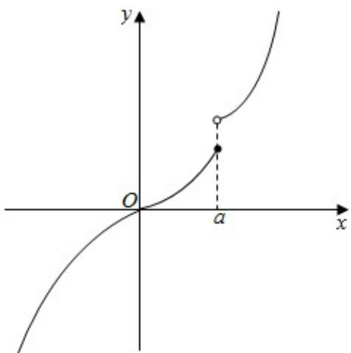
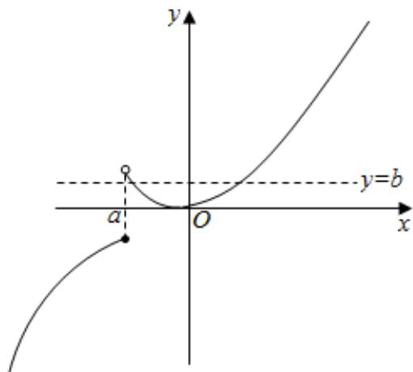

> [!faq]- 《专题14 指数、对数、幂函数、函数图象、函数零点及函数模型的应用》真题解析
>
> > [!success]- **【答案】** $(-\infty ,0)\cup (1, + \infty)$
>
> > [!note]- **【分析】**
> > 由 $g(x) = f(x) - b$ 有两个零点可得 $f(x) = b$ 有两个零点，即 $y = f(x)$ 与 $y = b$ 的图象有两个交点，则函数在定义域内不能是单调函数，结合函数图象可求 $a$ 的范围
>
> > [!note]- **【解析】**
> > ∵ $g(x)=f(x)-b$ 有两个零点，
> > $\therefore f(x) = b$ 有两个零点，即 $y = f(x)$ 与 $y = b$ 的图象有两个交点，
> > 由 $x^{3} = x^{2}$ 可得， $x = 0$ 或 $x = 1$
> > - **①**：当 a > 1 时，函数 $f(x)$ 的图象如图所示，此时存在 b ，满足题意，故 a > 1 满足题意
> > 
> > - **②**：当 a = 1 时，由于函数 $f(x)$ 在定义域 R 上单调递增，故不符合题意
> > - **③**：当 0 < a < 1 时，函数 $f(x)$ 单调递增，故不符合题意
> > 
> > - **④**：a = 0 时， $f(x)$ 单调递增，故不符合题意
> > - **⑤**：当 $a < 0$ 时，函数 $y = f(x)$ 的图象如图所示，此时存在 $b$ 使得， $y = f(x)$ 与 $y = b$ 有两个交点
> > 
> > 综上可得， $a < 0$ 或 $a > 1$
> > 故答案为： $(-∞,0)∪(1,+∞)$
> > 【点睛】
> > 本题考查了函数的零点问题，渗透了转化思想，数形结合、分类讨论的数学思想。
