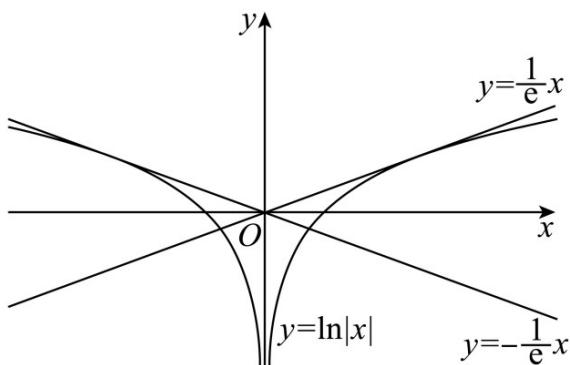

> [!faq]- 《专题16 导数及其应用小题综合》真题解析
>
> > [!success]- **【答案】** $y=\frac{1}{e}x\quad y=-\frac{1}{e}x$
>
> > [!note]- **【分析】**
> > 分 $x > 0$ 和 $x < 0$ 两种情况，当 $x > 0$ 时设切点为 $\left(x_0, \ln x_0\right)$ ，求出函数的导函数，即可求出切线的斜率，从而表示出切线方程，再根据切线过坐标原点求出 $x_0$ ，即可求出切线方程，当 $x < 0$ 时同理可得；【详解】[方法一]：化为分段函数，分段求
> >
> > 分 $x > 0$ 和 $x < 0$ 两种情况，当 $x > 0$ 时设切点为 $\left(x_0, \ln x_0\right)$ ，求出函数的导函数，即可求出切线的斜率，从而表示出切线方程，再根据切线过坐标原点求出 $x_0$ ，即可求出切线方程，当 $x < 0$ 时同理可得；
> >
> > 解：因为 $y = \ln |x|$
> >
> > 当 $x > 0$ 时 $y = \ln x$ ，设切点为 $\left(x_0, \ln x_0\right)$ ，由 $y' = \frac{1}{x}$ ，所以 $y'\big|_{x=x_0} = \frac{1}{x_0}$ ，所以切线方程为 $y - \ln x_0 = \frac{1}{x_0}(x - x_0)$ 又切线过坐标原点，所以 $-\ln x_0 = \frac{1}{x_0} (-x_0)$ ，解得 $x_0 = e$ ，所以切线方程为 $y - 1 = \frac{1}{e}(x - e)$ ，即 $y = \frac{1}{e} x$ 当 $x < 0$ 时 $y = \ln (-x)$ ，设切点为 $\left(x_1, \ln (-x_1)\right)$ ，由 $y' = \frac{1}{x}$ ，所以 $y'\big|_{x=x_1} = \frac{1}{x_1}$ ，所以切线方程为 $y - \ln (-x_1) = \frac{1}{x_1}(x - x_1)$
> >
> > 又切线过坐标原点，所以 $-\ln (-x_1) = \frac{1}{x_1} (-x_1)$ ，解得 $x_{1} = -\mathrm{e}$ ，所以切线方程为 $y - 1 = \frac{1}{-\mathrm{e}} (x + \mathrm{e})$ ，即 $y = -\frac{1}{\mathrm{e}} x$ 故答案为： $y = \frac{1}{\mathrm{e}} x$ ； $y = -\frac{1}{\mathrm{e}} x$
> >
> > ## [方法二]：根据函数的对称性，数形结合
> >
> > 当 $x > 0$ 时 $y = \ln x$ ，设切点为 $\left(x_0, \ln x_0\right)$ ，由 $y' = \frac{1}{x}$ ，所以 $y'\big|_{x=x_0} = \frac{1}{x_0}$ ，所以切线方程为 $y - \ln x_0 = \frac{1}{x_0}(x - x_0)$ 又切线过坐标原点，所以 $-\ln x_0 = \frac{1}{x_0} (-x_0)$ ，解得 $x_0 = e$ ，所以切线方程为 $y - 1 = \frac{1}{e}(x - e)$ ，即 $y = \frac{1}{e} x$ 因为 $y = \ln |x|$ 是偶函数，图象为：
> >
> > 
> >
> > 所以当 $x < 0$ 时的切线，只需找到 $y = \frac{1}{\mathrm{e}} x$ 关于 $Y$ 轴的对称直线 $y = -\frac{1}{\mathrm{e}} x$ 即可
> >
> > [方法三]：
> >
> > 因为 $y = \ln |x|$
> >
> > 当 $x > 0$ 时 $y = \ln x$ ，设切点为 $\left(x_0, \ln x_0\right)$ ，由 $y' = \frac{1}{x}$ ，所以 $y'\big|_{x=x_0} = \frac{1}{x_0}$ ，所以切线方程为 $y - \ln x_0 = \frac{1}{x_0}(x - x_0)$ 又切线过坐标原点，所以 $-\ln x_0 = \frac{1}{x_0} (-x_0)$ ，解得 $x_0 = e$ ，所以切线方程为 $y - 1 = \frac{1}{e}(x - e)$ ，即 $y = \frac{1}{e} x$
> >
> > 当 $x < 0$ 时 $y = \ln (-x)$ ，设切点为 $\left(x_{1},\ln \left(-x_{1}\right)\right)$ ，由 $y^{\prime} = \frac{1}{x}$ ，所以 $y^{\prime}|_{x = x_1} = \frac{1}{x_1}$ ，所以切线方程为
> >
> > $$
> > y - \ln (- x _ {1}) = \frac {1}{x _ {1}} (x - x _ {1})
> > $$
> >
> > 又切线过坐标原点，所以 $-\ln (-x_1) = \frac{1}{x_1} (-x_1)$ ，解得 $x_{1} = -\mathrm{e}$ ，所以切线方程为 $y - 1 = \frac{1}{-\mathrm{e}} (x + \mathrm{e})$ ，即 $y = -\frac{1}{\mathrm{e}} x$ 故答案为： $y = \frac{1}{\mathrm{e}} x$ ； $y = -\frac{1}{\mathrm{e}} x$
>
> > [!note]- **【解析】**
> > 本题未单列解析。
