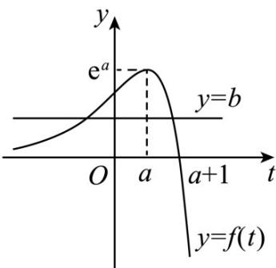
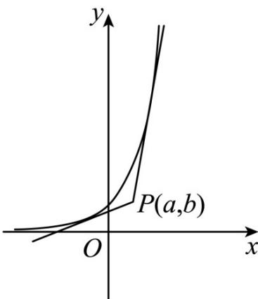

> [!faq]- 《专题16 导数及其应用小题综合》真题解析
>
> > [!success]- **【答案】** D
>
> > [!note]- **【分析】**
> > 【分析】结合导数的几何意义可得 $x_{1} + x_{2} = 0$ ，结合直线方程及两点间距离公式可得 $\left|AM\right| = \sqrt{1 + e^{2x_1}}\cdot \left|x_1\right|$ ， $\left|BN\right| = \sqrt{1 + e^{2x_2}}\cdot \left|x_2\right|$ ，化简即可得解·
>
> > [!note]- **【解析】**
> > 【详解】由题意， $f(x)=\left|e^{x}-1\right|=\begin{cases}1-e^{x},x<0\\e^{x}-1,x&0\end{cases}$ ，则 $f'(x)=\begin{cases}-e^{x},x<0\\e^{x},x>0\end{cases}$
> > 所以点 $A\left(x_{1},1-e^{x_{1}}\right)$ 和点 $B\left(x_{2},e^{x_{2}}-1\right)$ ， $k_{AM}=-e^{x_{1}},k_{BN}=e^{x_{2}}$
> > 所以 $-e^{x_1}\cdot e^{x_2} = -1,x_1 + x_2 = 0$
> > 所以 $AM: y - 1 + e^{x_{1}} = -e^{x_{1}}(x - x_{1}), M(0, e^{x_{1}}x_{1} - e^{x_{1}} + 1)$
> > 所以 $\left|AM\right|=\sqrt{x_{1}^{2}+\left(e^{x_{1}}x_{1}\right)^{2}}=\sqrt{1+e^{2x_{1}}}\cdot\left|x_{1}\right|$
> > 同理 $\left|BN\right|=\sqrt{1+e^{2x_{2}}}\cdot\left|x_{2}\right|$ ,
> > 所以 $\frac{|AM|}{|BN|}=\frac{\sqrt{1+e^{2x_{1}}}\cdot|x_{1}|}{\sqrt{1+e^{2x_{2}}}\cdot|x_{2}|}=\sqrt{\frac{1+e^{2x_{1}}}{1+e^{2x_{2}}}}=\sqrt{\frac{1+e^{2x_{1}}}{1+e^{-2x_{1}}}}=e^{x_{1}}\in(0,1)$ .
> > 故答案为： $(0,1)$
> > 【点睛】关键点点睛：
> > 解决本题的关键是利用导数的几何意义转化条件 $x_{1} + x_{2} = 0$ ，消去一个变量后，运算即可得解7．（2021·全国新I卷·高考真题）若过点 $(a,b)$ 可以作曲线 $y = \mathrm{e}^{x}$ 的两条切线，则（ ）A. $\mathrm{e}^b < a$ B. $\mathrm{e}^a < b$ C. $0 < a < \mathrm{e}^b$ D. $0 < b < \mathrm{e}^a$
> > 【答案】D
> > 【分析】解法一：根据导数几何意义求得切线方程，再构造函数，利用导数研究函数图象，结合图形确定结果；
> > 解法二：画出曲线 $y = e^{x}$ 的图象，根据直观即可判定点 $(a, b)$ 在曲线下方和 x 轴上方时才可以作出两条切线。
> > 【详解】在曲线 $y = e^{x}$ 上任取一点 $P(t, e^{t})$ ，对函数 $y = e^{x}$ 求导得 $y' = e^{x}$ ，
> > 所以，曲线 $y = e^{x}$ 在点 $P$ 处的切线方程为 $y - e^{t} = e^{t}(x - t)$ ，即 $y = e^{t}x + (1 - t)e^{t}$
> > 由题意可知，点 $(a,b)$ 在直线 $y = e^{t}x + (1 - t)e^{t}$ 上，可得 $b = ae^{t} + (1 - t)e^{t} = (a + 1 - t)e^{t}$
> > 令 $f(t)=(a+1-t)e^{t}$ ，则 $f'(t)=(a-t)e^{t}$ .
> > 当 t < a 时， $f'(t) > 0$ ，此时函数 $f(t)$ 单调递增，
> > 当 $t > a$ 时， $f'(t) < 0$ ，此时函数 $f(t)$ 单调递减，
> > 所以， $f(t)_{\mathrm{max}} = f(a) = e^a$
> > 由题意可知，直线 $y = b$ 与曲线 $y = f(t)$ 的图象有两个交点，则 $b < f(t)_{\max} = e^{a}$ ，
> > 当 $t < a + 1$ 时， $f(t) > 0$ ，当 $t > a + 1$ 时， $f(t) < 0$ ，作出函数 $f(t)$ 的图象如下图所示：
> > 
> > 由图可知，当 $0 < b < e^{a}$ 时，直线 $y = b$ 与曲线 $y = f(t)$ 的图象有两个交点
> > 故选：D.
> > 解法二：画出函数曲线 $y = e^{x}$ 的图象如图所示，根据直观即可判定点 $(a, b)$ 在曲线下方和 $x$ 轴上方时才可以作出两条切线·由此可知 $0 < b < e^{a}$ .
> > 
> > 故选：D.
> > 【点睛】解法一是严格的证明求解方法，其中的极限处理在中学知识范围内需要用到指数函数的增长特性进行估计，解法二是根据基于对指数函数的图象的清晰的理解与认识的基础上，直观解决问题的有效方法。
