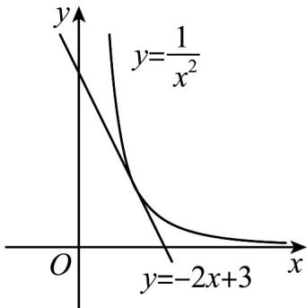

> [!faq]- 《专题16 导数及其应用小题综合》真题解析
>
> > [!success]- **【答案】** -3
>
> > [!note]- **【分析】**
> > 方法一：利用导数判断函数 $f(x)$ 在 $(0, +\infty)$ 上的单调性，确定零点位置，求出参数 $a \cdot$ 再根据函数 $f(x)$ 在 $[-1, 1]$ 上的单调性确定函数最值，即可解出
>
> > [!note]- **【解析】**
> > [方法一]：【通性通法】单调性法
> > 求导得 $f'(x)=6x^{2}-2ax$
> > 当 $a \leq 0$ 时，函数 $f(x)$ 在区间 $(0, +\infty)$ 内单调递增，且 $f(x) > f(0) = 1$ ，所以函数 $f(x)$ 在 $(0, +\infty)$ 内无零点；
> > 当 $a > 0$ 时，函数 $f(x)$ 在区间 $\left(0, \frac{a}{3}\right)$ 内单调递减，在区间 $\left(\frac{a}{3}, +\infty\right)$ 内单调递增。
> > 当 $x = 0$ 时， $f(0) = 1$ ；当 $x \to +\infty$ 时， $f(x) \to +\infty$
> > 要使函数 $f(x)$ 在区间 $(0, +\infty)$ 内有且仅有一个零点，只需 $f\left(\frac{a}{3}\right) = 0$ ，解得 $a = 3$ ：
> > 于是函数 $f(x)$ 在区间 $[-1,0]$ 上单调递增，在区间 $(0,1]$ 上单调递减，
> > $[f(x)]_{\max} = f(0) = 1, [f(x)]_{\min} = f(-1) = -4$ ，所以最大值与最小值之和为-3。
> > 故答案为：-3.
> > [方法二]：等价转化
> > 由条件知 $2x^{3} + 1 = ax^{2}$ 有唯一的正实根，于是 $a = \frac{2x^3 + 1}{x^2} = 2x + \frac{1}{x^2}$ 。令 $g(x) = 2x + \frac{1}{x^2}, x > 0$ ，则 $g'(x) = 2 - \frac{2}{x^3} = \frac{2(x^3 - 1)}{x^3}$ ，所以 $g(x)$ 在区间 $(0,1)$ 内单调递减，在区间 $(1, +\infty)$ 内单调递增，且 $g(1) = 3$ ，当 $x \to 0$ 时， $g(x) \to +\infty$ ；当 $x \to +\infty$ 时， $g(x) \to +\infty$ 。
> > 只需直线 $y = a$ 与 $g(x)$ 的图像有一个交点，故 $a = 3$ ，下同方法一。
> > [方法三]：【最优解】三元基本不等式
> > 同方法二得， $a=2x+\frac{1}{x^{2}}=x+x+\frac{1}{x^{2}}$ $3\sqrt[3]{x\cdot x\cdot\frac{1}{x^{2}}}=3$ ，当且仅当 $x=1$ 时取等号，
> > 要满足条件只需 $a = 3$ ，下同方法一.
> > [方法四]：等价转化
> > 由条件知 $2x^{3} + 1 = ax^{2}$ 有唯一的正实根，即方程 $2x + \frac{1}{x^2} = a$ 有唯一的正实根，整理得 $\frac{1}{x^2} = -2x + a(x > 0)$ ，即函数 $g(x) = \frac{1}{x^2}$ 与直线 $y = -2x + a$ 在第一象限内有唯一的交点。于是平移直线 $y = -2x + a$ 与曲线
> > $g(x)=\frac{1}{x^{2}}$ 相切时，满足题意，如图.
> > 
> > 设切点 $\left(x_0, \frac{1}{x_0^2}\right)$ ，因为 $g'(x) = -\frac{2}{x^3}$ ，于是 $-\frac{2}{x_0^3} = -2$ ，解得 $x_0 = 1, a = 3$ ，
> > 下同方法一.
> > 【整体点评】方法一：利用导数得出函数在 $(0,+\infty)$ 上的单调性，确定零点位置，求出参数，进而问题转化为闭区间上的最值问题，从而解出，是该类型题的通性通法；
> > 方法二：利用等价转化思想，函数在 $(0, +\infty)$ 上有唯一零点转化为两函数图象有唯一交点，从而求出参数，使问题得解；
> > 方法三：通过三元基本不等式确定取最值条件，从而求出参数，使问题得解，是该题的最优解；
> > 方法四：将函数在 $(0, +\infty)$ 上有唯一零点转化为直线与曲线相切，从而求出参数，使问题得解。
